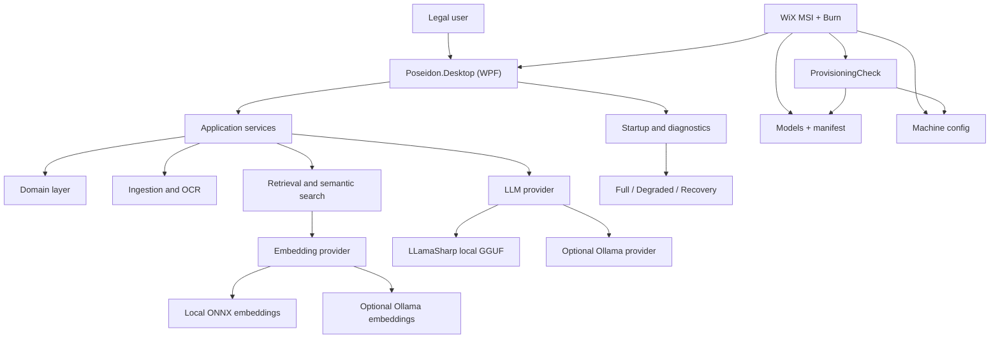
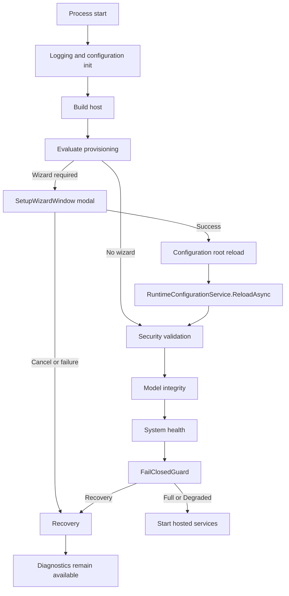

# Poseidon (LCDSS) Complete Technical Dossier

**Generated:** 2026-05-01T15:54:07.719Z UTC  
**Repository root:** `C:/LegalAI`  
**Validated release baseline:** `1.0.2.1`  
**Release package:** `C:/LegalAI/release/Poseidon-1.0.2.1`  
**Current status:** NONPRODUCTION CERTIFICATION PACKAGE; production signing infrastructure pending  
**Document purpose:** Architecture reference, deployment manual, governance record, certification narrative, technical encyclopedia, onboarding document, forensic reconstruction guide, operational handbook, and release authority reference.

---

## Document Control

This dossier is the definitive technical and operational knowledge source for Poseidon at the validated 1.0.2.1 certification baseline. It explains what the system is, why it exists, how it is structured, how it starts, how it is deployed, how it is secured, how models are validated, how failures are classified, and how enterprise release authority is established.

The document intentionally distinguishes technical validation from production approval. Runtime, installer, native backend, certification evidence, and artifact-only model remediation have been validated. Production signing remains pending because the required signing infrastructure, specifically signtool.exe and an approved code-signing certificate, was not available. Poseidon correctly failed closed rather than emitting unsigned production artifacts.

This document does not authorize runtime redesign, installer redesign, dependency upgrades, or model-loading changes. It records the controlled certification state and the release-governed path forward.

| Field | Value |
| --- | --- |
| Project | Poseidon (LCDSS) |
| Primary platform | Windows desktop enterprise legal decision support system |
| Authoritative installer | WiX MSI plus Burn bootstrapper |
| Validated version | 1.0.2.1 |
| Validated package status | Nonproduction certification package |
| Final model incident classification | FORMAT DRIFT AGAINST LLamaSharp 0.19.0 |
| Model remediation | Artifact-only model substitution: TinyLlama GGUF bytes staged under preserved filename Qwen_Qwen3.5-9B-Q5_K_M.gguf |
| Production gate | Fails closed without signing infrastructure |
| Remaining blocker | External signing infrastructure and formal release approval |

## Table of Contents

- 1. Executive Summary
- 2. Project History and Evolution
- 3. High-Level Architecture
- 4. Technology Stack
- 5. Desktop Application Deep Dive
- 6. API Architecture
- 7. AI and LLM Architecture
- 8. OCR and Arabic Processing
- 9. Security Architecture
- 10. Installer and Deployment System
- 11. Runtime Modes
- 12. Native Backend System
- 13. Logging, Diagnostics, and Evidence
- 14. Deterministic Build and Release Engineering
- 15. Certification and Governance
- 16. The GGUF Incident
- 17. Enterprise Deployment Readiness
- 18. Production Signing Model
- 19. Operational Runbooks
- 20. Risks and Future Considerations
- 21. Rejected Alternatives
- 22. Final Certification State
- 23. Decision Register
- 24. Evidence Inventory
- 25. Reviewer Checklist
- 26. Failure Mode Catalog
- 27. Detailed Operational Scenario Narratives
- 28. Reviewer Question and Answer Reference
- 29. Glossary
- 30. Implementation-Level Reference
- 31. Release Command Reference

---

# 1. Executive Summary

Poseidon is an enterprise Windows desktop legal decision support system. It is designed to ingest documents, extract text, generate embeddings, perform semantic retrieval, and assist legal querying using locally controlled AI models. Its design prioritizes privacy, auditability, deterministic deployment, recoverable diagnostics, and enterprise release governance.

Poseidon exists because legal AI cannot be treated as an ordinary chatbot. Legal documents can be privileged, confidential, personally identifiable, regulated, or commercially sensitive. Answers must be grounded in evidence. Runtime state must be explicit. Installer behavior must be deterministic. Security posture must be enforceable. Release artifacts must be auditable.

The product has moved through staged hardening: first-launch reliability, installer consolidation, security hardening, repository consolidation, release assurance, certification governance, and operational certification execution. The current state is enterprise-certification gated: software engineering maturity is complete for the validated path, while production signing and release authority remain organizational gates.

The validated release baseline is 1.0.2.1. The release bundle at C:/LegalAI/release/Poseidon-1.0.2.1 contains installer artifacts, evidence bundles, hashes, provenance, classification, and runtime validation evidence. It is intentionally marked as a nonproduction certification package because production signing was not executed.

The most important recent certification finding is that the original Qwen GGUF model failed under LLamaSharp 0.19.0 with LoadWeightsFailedException while a TinyLlama GGUF loaded successfully under the same runtime, backend, installer, and configuration path. This proved a model compatibility boundary rather than a runtime or installer failure. The approved remediation was artifact-only: stage TinyLlama bytes under the preserved filename contract and document the substitution in model-payload-lock.json and evidence bundles.

## Executive Goals

| Goal class | Poseidon objective |
| --- | --- |
| Business | Support private legal document analysis and evidence-grounded legal querying. |
| Technical | Provide a layered .NET desktop and service architecture with local AI capability. |
| Security | Fail closed on invalid config, weak secrets, model tampering, or unsigned production builds. |
| Deployment | Use WiX/Burn as the single authoritative enterprise installer path. |
| Operations | Support diagnostics, recovery, repair, upgrade, rollback, and enterprise deployment evidence. |
| Governance | Provide deterministic builds, provenance, hashes, signing gates, and release authority artifacts. |


# 2. Project History and Evolution

Poseidon originated as an inherited production-grade codebase with valuable functional capabilities but with deployment and maintenance risks typical of a migrated enterprise project. Historical residue included LegalAI naming, parallel installer concepts, obsolete setup flows, generated artifacts, stale diagnostics, and documentation drift.

The remediation program deliberately avoided a rewrite. The strategy was to understand the existing architecture, preserve working behavior, eliminate non-determinism, consolidate installer truth, harden security, and build release evidence. This was a modernization and certification effort, not a product reinvention.

The project evolved through explicit priorities. Priority 1 fixed first-launch reliability. Priority 2 made WiX/Burn the installer authority. Priority 3 hardened authentication, configuration, installer, supply chain, and operational secrets. Priority 4 removed legacy drift. Priority 5 established release assurance. Priority 6 established enterprise certification governance. Priority 7 locked the system into controlled certification mode.

## Evolution Timeline

| Phase | Purpose | Outcome |
| --- | --- | --- |
| Initial audit | Understand architecture and risks before code changes | Established authoritative handoff context. |
| Priority 1 | First-launch reliability | Setup wizard invoked before hosted services; config generation and reload deterministic. |
| Priority 1.5 | Correct stale DI and mixed provider validation | RuntimeConfigurationService reload and component-independent provider validation. |
| Priority 2 | Installer consolidation | WiX MSI plus Burn selected as sole enterprise installer truth. |
| Priority 3A | Authentication and config security | JWT, management API, schema, and user override boundaries hardened. |
| Priority 3B | Installer and supply-chain security | Signing enforcement, prerequisite pinning, manifest strictness, production gates. |
| Priority 3C | Secret storage and operational security | DPAPI references, secret segregation, rotation readiness, audit logging. |
| Priority 4 | Repository consolidation | Legacy LegalAI operational residue removed from active paths; docs and determinism improved. |
| Priority 5 | Release assurance | Clean clone proof, governance package, release evidence generation, fail-closed production signing gate. |
| Priority 6 | Deployment certification governance | Operational certification framework for signing, enterprise deployment, compliance, and support. |
| Priority 7 | Controlled enterprise release certification | Strict freeze, evidence-only remediation, model compatibility classification, nonproduction certification package. |


## Why the Program Became Governance-Driven

By the time Priority 7 began, the project was no longer in broad engineering mode. The system had reached a stage where most changes would increase risk by invalidating prior evidence. The correct operating model became release governance: execute gates, capture evidence, and remediate only proven certification blockers.

This discipline prevented speculative changes during the GGUF incident. Instead of upgrading LLamaSharp, changing backend libraries, or redesigning model loading, the team proved the failure domain, isolated deployment drift, re-established a clean runtime baseline, and remediated with a compatible model artifact.


# 3. High-Level Architecture

Poseidon is a layered .NET system centered on a WPF desktop application. The desktop coordinates user interaction, local startup, diagnostics, setup wizard flow, and legal query workflows. Supporting components include API surfaces, worker services, domain/application layers, ingestion, retrieval, infrastructure providers, security validation, provisioning-check, and WiX/Burn installer projects.

The architecture intentionally separates concerns. Startup policy is not mixed with document ingestion. Model integrity is not left to UI code. Installer provisioning is not treated as a best-effort convenience. Security validation is shared and fail-closed. This separation makes the system more auditable and safer to certify.



## Component Map

| Component | Role | Certification relevance |
| --- | --- | --- |
| Poseidon.Desktop | WPF desktop application | Primary user entry point, startup orchestration, diagnostics, setup wizard, runtime mode presentation, local user workflow. |
| Poseidon.Api | ASP.NET Core API | Authenticated application API surface, legal query and integration layer where deployed. |
| Poseidon.Management.Api | Management plane | Enterprise management and operational coordination, hardened with keys and replay-aware governance. |
| Poseidon.WorkerService | Background worker | Background ingestion or processing host where service deployment is used. |
| Poseidon.ProvisioningCheck | Installer/runtime validator | Validates config, models, manifests, hashes, provider modes, and production trust contract. |
| Poseidon.Domain | Domain layer | Core legal and application entities and rules. |
| Poseidon.Application | Application layer | Use-case orchestration, application services, contracts. |
| Poseidon.Ingestion | Document ingestion | Document parsing, OCR coordination, chunking, ingestion workflows. |
| Poseidon.Retrieval | Semantic retrieval | Embeddings, vector search, evidence selection, retrieval strategy. |
| Poseidon.Infrastructure | Provider layer | LLM providers, embedding providers, model integrity, configuration, filesystem, native backend integration. |
| Poseidon.Security | Trust boundary | JWT validation, secret validation, DPAPI references, fail-closed config policy. |
| installer | WiX/Burn deployment system | Builds MSI, Burn bundle, machine config, model manifest, and post-install validation. |
| docs and release evidence | Governance artifacts | Release checklists, deployment matrix, signing runbooks, provenance, hash manifests, certification evidence. |


## Startup Sequence

Startup is a controlled pipeline. Configuration and logging initialize first. The dependency host is built, but hosted services are not started immediately. First-launch provisioning is evaluated before background work begins. If the setup wizard is required, it is shown modally. On success, configuration is reloaded and runtime services refresh their provider bindings. Security validation, model integrity, health checks, and fail-closed guard initialization then determine runtime mode. Hosted services start only when the system is Full or explicitly acceptable Degraded.

This order is central to first-launch reliability. It prevents file watchers, ingestion services, or provider health loops from consuming stale configuration or triggering false Recovery before the user has had a chance to provision the system.




## Data Flow

Documents enter through the desktop. Ingestion extracts text, invokes OCR when necessary, normalizes content, chunks text, and generates embeddings. Retrieval uses those embeddings to identify relevant evidence. Legal questions are answered by passing retrieved evidence to an LLM provider. The intended answer pattern is evidence-constrained, not free-form speculative generation.

Every stage has operational consequences. Poor OCR harms retrieval. Missing embeddings prevent semantic search. Missing or incompatible LLMs affect generated answers. Invalid manifests or hashes block startup or provisioning. This is why model, config, and provider validation are treated as release-critical.


# 4. Technology Stack

The technology stack is selected for enterprise Windows deployment, local AI operation, deterministic installation, and auditable security. The stack favors operational control over novelty. Every technology choice carries a deployment implication and a certification implication.

## .NET 8 and layered C#

**Why selected:** Provides desktop, API, worker, configuration, DI, logging, and Windows integration in one platform.

**Operational implication:** Requires pinned SDK/package versions and locked restore to prevent drift.

**Rejected direction:** Replacing this component during certification was not allowed unless a certified gate failure proved it necessary. The project prioritizes stable validated behavior over speculative modernization.


## WPF

**Why selected:** Delivers native Windows desktop UX and local diagnostics.

**Operational implication:** Ties primary UX to Windows, which is acceptable because enterprise Windows deployment is the target.

**Rejected direction:** Replacing this component during certification was not allowed unless a certified gate failure proved it necessary. The project prioritizes stable validated behavior over speculative modernization.


## ASP.NET Core

**Why selected:** Supports API and management surfaces with mature authentication and middleware.

**Operational implication:** Must fail closed on bad auth/config outside explicit development.

**Rejected direction:** Replacing this component during certification was not allowed unless a certified gate failure proved it necessary. The project prioritizes stable validated behavior over speculative modernization.


## WiX MSI

**Why selected:** Provides enterprise Windows Installer semantics: install, repair, upgrade, uninstall, policy deployment.

**Operational implication:** Requires careful versioning, component identity, signing, and harvest control.

**Rejected direction:** Replacing this component during certification was not allowed unless a certified gate failure proved it necessary. The project prioritizes stable validated behavior over speculative modernization.


## Burn bootstrapper

**Why selected:** Orchestrates MSI, prerequisites, external payloads, logging, and full install path.

**Operational implication:** Must avoid stale cache ambiguity through versioning and validation.

**Rejected direction:** Replacing this component during certification was not allowed unless a certified gate failure proved it necessary. The project prioritizes stable validated behavior over speculative modernization.


## LLamaSharp 0.19.0

**Why selected:** Enables local GGUF inference from .NET through llama.cpp native libraries.

**Operational implication:** Compatibility is bounded by the bundled native backend snapshot. Newer GGUFs may fail.

**Rejected direction:** Replacing this component during certification was not allowed unless a certified gate failure proved it necessary. The project prioritizes stable validated behavior over speculative modernization.


## GGUF

**Why selected:** Model container for llama.cpp-compatible quantized models.

**Operational implication:** Valid GGUF does not guarantee compatibility with older backends.

**Rejected direction:** Replacing this component during certification was not allowed unless a certified gate failure proved it necessary. The project prioritizes stable validated behavior over speculative modernization.


## ONNX embeddings

**Why selected:** Local embedding provider option.

**Operational implication:** Requires valid ONNX file and provider-specific validation.

**Rejected direction:** Replacing this component during certification was not allowed unless a certified gate failure proved it necessary. The project prioritizes stable validated behavior over speculative modernization.


## Ollama provider mode

**Why selected:** Optional external model service for LLM or embeddings.

**Operational implication:** Endpoint and selected model must validate per component; cannot mask local model requirements.

**Rejected direction:** Replacing this component during certification was not allowed unless a certified gate failure proved it necessary. The project prioritizes stable validated behavior over speculative modernization.


## JWT

**Why selected:** API authentication mechanism.

**Operational implication:** Production requires strong secrets, issuer, audience, and protected secret references.

**Rejected direction:** Replacing this component during certification was not allowed unless a certified gate failure proved it necessary. The project prioritizes stable validated behavior over speculative modernization.


## DPAPI

**Why selected:** Windows-native secret protection.

**Operational implication:** Operational runbooks must account for scope, backup, rotation, and service identity.

**Rejected direction:** Replacing this component during certification was not allowed unless a certified gate failure proved it necessary. The project prioritizes stable validated behavior over speculative modernization.


## CPU AVX2 native backend

**Why selected:** Deterministic local inference fallback.

**Operational implication:** Performance may be lower than GPU but deployment is more reliable.

**Rejected direction:** Replacing this component during certification was not allowed unless a certified gate failure proved it necessary. The project prioritizes stable validated behavior over speculative modernization.


## CUDA optional backend

**Why selected:** Potential acceleration when compatible CUDA v12 environment exists.

**Operational implication:** CUDA version drift can break loading; not required for baseline certification.

**Rejected direction:** Replacing this component during certification was not allowed unless a certified gate failure proved it necessary. The project prioritizes stable validated behavior over speculative modernization.


# 5. Desktop Application Deep Dive

The desktop application is the operational center of Poseidon. It is responsible for user workflow, first-launch behavior, diagnostics, local configuration interpretation, runtime mode display, and launching the safe parts of the system only after trust and provisioning checks complete.

## Startup Pipeline Details

| Step | Action | Reason |
| --- | --- | --- |
| 1 | Initialize logging | Failures must be captured from the earliest possible moment. |
| 2 | Load configuration | Runtime must know machine and user config sources before provisioning decisions. |
| 3 | Build host | Services are registered, but hosted services are not yet started. |
| 4 | Evaluate ShouldShowSetupWizard | Clean machines or invalid first-launch states are intercepted. |
| 5 | Show SetupWizardWindow modally if needed | Normal startup is blocked until provisioning succeeds or Recovery is chosen. |
| 6 | Reload configuration root | Wizard-generated config becomes visible to configuration providers. |
| 7 | RuntimeConfigurationService.ReloadAsync | Reloadable providers refresh state so DI does not remain stale. |
| 8 | Security validation | Production-insecure config cannot start. |
| 9 | Model integrity validation | Manifests and hashes are verified before model use. |
| 10 | System health checks | Full, Degraded, or Recovery state is determined. |
| 11 | FailClosedGuard initialization | Unsafe operations are blocked when state is not valid. |
| 12 | Start hosted services if allowed | Background services consume only final validated state. |


## First-Launch Reliability Rationale

A clean enterprise install must not depend on manual post-install surgery. If the first launch begins file watching, ingestion, or model health checks before the config exists, the app can enter a misleading dead state. The corrected flow evaluates provisioning after configuration/logging initialization but before _host.StartAsync().

The setup wizard is not a UX preference; it is part of the runtime safety model. It ensures required model/provider/config choices are established before services act on them.


## Recovery Behavior

Recovery mode is deliberately not the same as a crash. Recovery preserves diagnostic capability while blocking unsafe behaviors such as ingestion or unsupported query execution. It gives support engineers enough information to repair the machine without letting the system pretend to be fully operational.

Wizard cancellation, invalid config, corrupt JSON, missing required local models, invalid provider declarations, failed model hashes, and production security failures can force Recovery or fail-closed behavior depending on component severity.


## Desktop Certification Signals

The validated runtime produced positive evidence that the native backend preflight passed, the LLamaSharp model loaded successfully, system health was evaluated, and FailClosedGuard allowed a valid Degraded state. The Degraded state was accepted because there were no critical errors and the warning profile was known and non-blocking under the manifest.


# 6. API Architecture

Poseidon includes API surfaces for application and management workflows. The API architecture follows the same enterprise posture as the desktop: configuration must be validated, authentication must be explicit, and production startup must fail closed on insecure defaults.

The API layer is not allowed to be a weaker trust boundary than the desktop. Placeholder JWT secrets, missing issuer or audience, empty management keys, and insecure development fallbacks are production blockers. This matters because management and API endpoints can expose operational control or sensitive legal data.

## Authentication and Authorization

JWT authentication is accepted only when configured securely. Production keys must have sufficient entropy, must not match placeholder patterns, and must be accompanied by issuer and audience. Development mode can permit explicit insecure behavior only when the development flag is intentionally enabled.

Authorization should be treated as endpoint-specific, not global assumption. Public endpoints must be minimized. Health and diagnostics endpoints must not leak secrets or allow management operations without authentication.


## Legal Query Flow

A legal query enters through an authenticated application surface. The query is normalized, embedded or otherwise transformed for retrieval, matched against indexed document chunks, and converted into an evidence set. The LLM is then asked to produce an answer constrained by that evidence. This architecture prevents the LLM from being the source of truth. The documents and retrieved passages remain the source of truth.

The API must preserve enough metadata to support explainability: what documents were searched, which chunks were selected, and what evidence supported the answer. In legal workflows, a plausible answer without traceability is operationally weak.


## Background Processing

Background processing belongs in worker services or hosted services after startup state is validated. It must not begin before provisioning, security, model integrity, and runtime mode gates complete. The same principle that protects desktop first launch also protects API and worker hosts: consumers of configuration must wait for final validated configuration.


## Management Plane

The management plane is hardened beyond empty shared-key behavior. ManagementApiKey and AgentApiKey cannot be empty or placeholder values outside explicit development. Durable nonce storage, replay resistance, mTLS readiness, key rotation, and persistent management state are identified as governance and maturity concerns. The current certified scope treats management hardening as production-acceptable but with long-term operational maturity work documented.


# 7. AI and LLM Architecture

Poseidon uses AI in a retrieval-oriented legal decision support architecture. The model is not treated as an oracle. The system first ingests and indexes documents, then retrieves relevant evidence, then asks the model to generate a response constrained by that evidence. This design is a direct response to the legal risk of hallucinated or unsupported answers.

The AI architecture has two major provider families: embeddings and LLMs. Each provider family validates independently. A valid LLM provider does not imply a valid embedding provider, and a valid embedding provider does not imply a valid LLM provider.

## Embeddings

Embeddings are vector representations of document chunks and queries. They enable semantic matching when exact terms differ. In legal documents, the same concept may appear in statutory language, contractual language, litigation language, or narrative evidence. Embeddings help bridge that vocabulary gap.

Poseidon supports local ONNX embeddings and optional Ollama embeddings depending on configuration. The provider mode is explicit. For ONNX, the model file must exist, be readable, have the correct extension, and match integrity expectations. For Ollama embeddings, the endpoint and selected embedding model must be available.


## Chunking and Retrieval

Chunking converts long documents into searchable units. Chunk size and overlap affect retrieval quality. Chunks that are too small lose context; chunks that are too large reduce retrieval precision and waste context window budget. Legal documents often rely on surrounding clauses, definitions, headings, and references, so chunking must preserve enough context for evidence interpretation.

Retrieval selects candidate chunks using semantic similarity and metadata. The selected evidence becomes the basis for answer generation. Retrieval is therefore a safety mechanism as well as a search mechanism.


## Evidence-Constrained Generation

The LLM should answer based on retrieved evidence rather than free-form world knowledge. The practical goal is not to eliminate all model risk but to reduce unsupported reasoning and provide users with traceable source material. In legal workflows, every material answer should be inspectable against underlying documents.

Prompt safety in Poseidon is not only about malicious prompts. It is also about legal reliability: instructing the model to distinguish known evidence from uncertainty, avoid unsupported legal conclusions, and surface limitations.


## Local Inference

Local inference through LLamaSharp is selected because legal document contents should remain within the enterprise boundary. Local inference also reduces dependency on external availability and supports offline environments. The tradeoff is that model compatibility, native library loading, memory pressure, and CPU/GPU support become deployment responsibilities.

This tradeoff is acceptable only if installer, manifest, backend, and runtime validation are strong. Poseidon therefore validates model files, native backend layout, provider mode, and runtime load behavior.


## GGUF and Quantization

GGUF files package model tensors and metadata for llama.cpp-compatible runtimes. Quantization reduces model size and memory requirements at the cost of some quality. Conservative quantizations such as Q4_0 are broadly compatible and CPU-friendly. More modern quantizations or architectures may require newer llama.cpp support.

The certification incident proved that a GGUF file can be present, readable, and valid in general but still incompatible with the bundled LLamaSharp 0.19.0 native backend. This is why model selection is part of release certification, not merely an installer asset choice.


## LLamaSharp Interaction

LLamaSharp loads model weights and creates an inference context through native llama.cpp libraries. Poseidon performs a native backend preflight before model load. It searches installed runtime native paths, detects CPU AVX2 backend files, conditionally avoids unsupported CUDA paths, and configures LLamaSharp native library probing.

A successful runtime proof requires more than file existence. It must show that native libraries loaded and that the LLM model loaded successfully. The validated baseline captured the positive signal: LLM model loaded successfully via LLamaSharp.


## Model Manifest and Hash Validation

The model manifest binds expected model identity to file name, size, hash, mode, and target path. Hash validation detects corruption, truncation, stale payloads, and unauthorized replacement. In production, missing required hashes or mismatched model entries are release blockers.

The manifest is also the reason vocab.txt is not treated as required unless explicitly declared. A warning that vocab.txt is absent is not a blocker when the manifest does not require it and the runtime can proceed through validated fallback behavior.


# 8. OCR and Arabic Processing

Poseidon includes document ingestion and OCR responsibilities because legal evidence frequently exists as scanned PDFs, images, or mixed-quality documents. OCR converts image-based content into searchable text, enabling indexing, embeddings, and retrieval.

Arabic processing requires special care. Arabic is right-to-left, may include diacritics, ligatures, contextual shaping, orthographic variants, and OCR noise that affects tokenization and semantic retrieval. In legal settings, small OCR errors can change names, dates, amounts, or obligations.

## Arabic-Specific Challenges

| Challenge | Impact | Operational handling |
| --- | --- | --- |
| Right-to-left layout | Text extraction order can be wrong | OCR and normalization must preserve reading order where possible. |
| Diacritics | Search and embeddings may mismatch variants | Normalization must be consistent with retrieval goals. |
| Ligatures and shaping | Extracted code points may differ from expected terms | Text normalization and review workflows are important. |
| Mixed Arabic/Latin documents | Names, citations, dates, and numbers may cross scripts | Chunking and OCR must not assume one script. |
| Low-quality scans | OCR confidence may be weak | Diagnostics and user review paths are needed. |


## Search Implications

OCR quality directly affects search quality. Bad OCR produces bad embeddings. Bad embeddings produce weak retrieval. Weak retrieval produces weak evidence grounding. The architecture therefore treats ingestion quality as an upstream determinant of legal answer quality.

The system should preserve enough diagnostics to distinguish a model failure from an OCR or ingestion failure. If a query produces poor answers because documents were badly OCRed, upgrading the LLM is the wrong fix.


# 9. Security Architecture

Poseidon security is organized around fail-closed trust boundaries. Production systems must not run with placeholder JWT secrets, empty management keys, weak secrets, missing issuer/audience, invalid machine config, missing hashes, unsigned production artifacts, or user config that weakens machine policy.

Security is not bolted onto one layer. It exists in configuration validation, API startup, management API hardening, installer build gates, model integrity validation, secret storage, runtime guard behavior, and release evidence.

## Fail-Closed Model

Fail closed means uncertainty stops the operation. If a production build cannot sign artifacts, it stops. If a runtime config is invalid, the system enters Recovery or fails startup. If a model hash mismatches, the deployment is not trusted. If authentication secrets are weak, production startup is denied.

This posture is appropriate because Poseidon handles legal information and produces AI-assisted outputs. Silent compromise or silent degraded behavior would undermine both security and legal reliability.


## Secret Handling

Production secrets are represented through protected references where possible, including DPAPI-backed references such as dpapi:LocalMachine:Poseidon/... . Machine config should store references, not plaintext secret values. Runtime resolves secrets securely and diagnostics distinguish missing, corrupt, or invalid secrets without exposing values.

Development can preserve explicit insecure mode for productivity, but only when the environment is Development and the insecure flag is deliberately enabled. This prevents accidental production operation with developer defaults.


## JWT and Management API

JWT signing secrets require minimum strength and cannot be placeholders. Issuer and audience are required outside development. ManagementApiKey and AgentApiKey cannot be empty outside development. Heartbeat and management endpoints must fail closed rather than allowing public control paths.

The management plane also requires audit logging of authentication failures, replay considerations, key rollover readiness, and a future mTLS roadmap. The present release records these as operational maturity items, not reasons to redesign the core during certification.


## User Config Trust Boundary

User config is allowed to express user preferences, watch folders, diagnostics settings, and local UX choices. It must not override trusted machine model paths, model integrity hashes, strict mode, production secrets, security policies, or provider security mode. This prevents a local user or corrupted profile from weakening enterprise policy.

The trust hierarchy is machine policy first, validated installer output second, user preferences only within allowed scope. This hierarchy is central to enterprise deployment.


## Installer and Model Integrity

The installer must generate or carry valid config and manifests. ProvisioningCheck validates JSON, providers, file existence, readability, extensions, hashes, machine config correctness, and security expectations. Production packaging fails on insecure defaults, missing required hashes, unsigned artifacts, test models, disabled encryption, or weak degraded mode declarations.

Model trust is cryptographic at the artifact level. A model file is not trusted because it has a familiar name; it is trusted because the manifest expects its hash and the installed file matches.


# 10. Installer and Deployment System

The official installer architecture is WiX MSI plus Burn. This decision eliminated installer split-brain and established a single enterprise deployment contract. Inno is retired from operational truth. The official outputs are Poseidon.Installer.msi, Poseidon.Bundle.exe, and Setup.exe.

The installer does more than copy files. It establishes the runtime contract: binaries, native backends, machine config, model placement, manifest, provisioning-check, post-install validation, and production signing enforcement.

## WiX MSI Responsibilities

| Responsibility | Description |
| --- | --- |
| Install application binaries | Desktop, infrastructure DLLs, dependencies, native backends. |
| Install ProvisioningCheck | Validation executable used by installer and CI gates. |
| Install machine config | Validated appsettings.user.json under install directory where applicable. |
| Install model manifest | model-manifest.json with required entries and hashes. |
| Install model files | Bundled models under deterministic Models directory when full local mode is used. |
| Support repair/uninstall/upgrade | Windows Installer lifecycle semantics. |


## Burn Responsibilities

| Responsibility | Description |
| --- | --- |
| Bootstrap entry point | Setup.exe / Poseidon.Bundle.exe is the complete install path. |
| Prerequisite handling | Coordinates prerequisites and validates pinned hashes. |
| External payload orchestration | Supports model payloads outside MSI when needed. |
| Logging | Produces bundle logs for deployment evidence. |
| Enterprise silent install | Supports /quiet /norestart and system deployment scenarios. |


## Same-Version Servicing Issue

The certification process discovered deployment drift caused by same-version servicing ambiguity. Installed binaries did not match validated publish output, and runtime symptoms showed an old FailClosedGuard/native backend state. Windows Installer and Burn can reuse cached packages or treat same-version installs as repair-like operations. This is operationally dangerous during certification because it makes it unclear which payload is actually installed.

The accepted remediation was a version bump to 1.0.2.1. This was packaging-only and within Priority 7 scope because it directly resolved a certification gate. The version bump made the replacement deterministic and produced auditable Burn install evidence.


## Payload Harvesting and Native Backends

The installer must preserve the native backend layout expected by LLamaSharp. The validated path requires CPU AVX2 backend files under runtimes/win-x64/native/cpu-avx2, including llama.dll and ggml.dll. A publish output that contains correct native files is not enough; the installed layout must match.

HEAT warnings are treated as packaging signal quality concerns. They are not necessarily functional blockers, but excessive warning noise can hide real drift. Future packaging maturity should reduce HEAT5151 noise and fail CI on new unexpected harvest warnings.


## External Payload Mode

Full local models may exceed comfortable MSI payload limits. The enterprise deployment documentation defines an external payload mode where Setup.exe and payload/Models content remain together. In that mode, direct MSI install is invalid for a full local deployment because the MSI alone may not carry all model bytes.

This is not a weakening of installer authority. Burn remains the authority because it knows the complete payload layout and can validate the full deployment contract.


## Production Build Gate

Production builds require signing. The attempted production build correctly failed closed because signtool.exe was unavailable. This is a successful enforcement result, not a product defect. The release package records this in PRODUCTION-BUILD-GATE.txt so reviewers understand why no signed production installer exists yet.

Required production signing inputs are Windows SDK signtool.exe, an approved code-signing certificate, certificate access policy, and an RFC3161 timestamp authority.


# 11. Runtime Modes

Poseidon uses explicit runtime modes so operational state is visible and deterministic. The system does not present all partial states as success.

| Mode | Meaning | Typical triggers | Operational consequence |
| --- | --- | --- | --- |
| Full | All required providers, config, secrets, and model integrity checks pass. | Valid full local LLM, valid embeddings, valid secrets, valid manifest. | Normal operation. |
| Degraded | System is intentionally or safely limited but usable. | Explicit degraded deployment, non-blocking warnings, omitted LLM only when declared valid. | Allowed operation with visible limitations. |
| Recovery | Critical requirement failed or trust cannot be proven. | Invalid config, missing required model, hash mismatch, security failure, wizard cancel. | Unsafe services blocked; diagnostics remain. |

## Why Three Modes Instead of Healthy/Unhealthy

A binary health model cannot express enterprise reality. A system with embeddings but no local LLM by design is not the same as a system with a corrupt model. A system with a non-blocking tokenization warning is not the same as a system with invalid secrets. Full, Degraded, and Recovery let the product express capability, limitation, and unsafe state separately.


## Transition Rules

Configuration and security failures outside development force fail-closed behavior. Missing embeddings are Recovery because semantic retrieval depends on embeddings. Missing local LLM is Recovery in full mode unless the deployment explicitly declares a degraded or external provider mode. Ollama providers require endpoint and selected model validation per component. Model hash mismatch is Recovery or provisioning failure.

Recovery is entered deterministically when validation fails. The application must never proceed as Full after wizard cancellation, invalid JSON, missing critical models, or invalid production secrets.


# 12. Native Backend System

LLamaSharp depends on native llama.cpp libraries. The native backend system is therefore part of deployment correctness, not just runtime implementation detail. Poseidon validates native backend layout and logs explicit backend preflight results.

The certified baseline uses CPU AVX2 fallback as a deterministic path. CUDA acceleration is optional and only enabled when compatible conditions are detected. CUDA version mismatch can produce native load failures, so CUDA cannot be assumed in enterprise deployment.

## Backend Probing Logic

| Probe | Purpose |
| --- | --- |
| AppContext.BaseDirectory | Find native libraries installed with the application. |
| runtimes/win-x64/native | Find RID-specific native payloads. |
| cpu-avx2 subdirectory | Bind deterministic CPU AVX2 backend. |
| CUDA path detection | Avoid unsupported CUDA version drift. |
| NativeLibraryConfig | Configure LLamaSharp native probing where available. |


## Certification-Relevant Signals

Positive backend evidence is required. Absence of an error is weaker than a log showing LLamaSharp native backend preflight passed and LLM model loaded successfully. The final runtime proof captured both signals.

The original failed baseline had native load issues before model classification could be trusted. The team correctly halted GGUF testing until deployment drift and native backend layout were fixed.


# 13. Logging, Diagnostics, and Evidence

Poseidon treats logs and evidence as first-class release artifacts. A system is not considered validated merely because a developer observed success. The success must be reproducible, documented, hashable, and inspectable by another reviewer.

The evidence model includes startup logs, runtime logs, provisioning logs, installer logs, Burn summaries, model hashes, manifest snapshots, signature evidence, provenance, and integrity manifests.

## Log Classes

| Log or evidence | Purpose |
| --- | --- |
| startup.log | Shows early runtime decisions, provisioning, mode transitions, and fatal startup issues. |
| app.log | Shows application runtime behavior, provider events, and operational warnings. |
| Burn install log | Shows bundle planning, caching, package application, and installation result. |
| MSI logs | Show Windows Installer actions, repair, rollback, custom actions, and provisioning-check integration. |
| Provisioning logs | Show config/model/provider/hash validation results. |
| SHA256SUMS.txt | Provides release artifact integrity registry. |
| artifact-integrity-pass.txt | Records final integrity verification after package assembly. |
| classification.txt | Summarizes the certified incident conclusion. |
| PRODUCTION-BUILD-GATE.txt | Documents production signing blocker and fail-closed behavior. |


## Evidence Bundle Design

Evidence bundles are self-describing. They should include an index, environment fingerprint, model hashes, manifest copy, runtime logs, exception extraction, classification, UTC timestamp, known-good model provenance, and bundle integrity hash. This allows a reviewer to reconstruct the test without relying on memory or informal notes.

The GGUF evidence bundles used this pattern. They captured baseline model state, replacement model identity, manifest correlation, runtime behavior, failure signature, runtime mode, fallback checks, access-error checks, execution statement, and bundle hashes.


# 14. Deterministic Build and Release Engineering

Deterministic build and release engineering are necessary because enterprise certification depends on reproducibility. A package must be tied to source, dependencies, build profile, model assets, manifests, hashes, and signing state. Without deterministic build discipline, a release cannot be audited confidently.

Poseidon uses locked restore, pinned packages, build profiles, repository hygiene checks, release manifests, and provenance artifacts. Production builds fail when signing prerequisites are absent.

## Build Principles

| Principle | Implementation |
| --- | --- |
| Locked dependencies | dotnet restore with locked mode prevents unplanned dependency drift. |
| Pinned SDK and package versions | Local and CI environments should align. |
| No generated artifact pollution | publish, installer output, obj/bin, logs, and QA evidence are excluded or curated. |
| Build provenance | Git HEAD, dirty state, patch hashes, and build metadata bind artifacts to inputs. |
| Artifact hashes | SHA-256 hashes are generated after final mutation. |
| Production signing gate | Production build cannot emit unsigned artifacts. |


## Validated Commands

The validated engineering pipeline used restore, build, unit test, nonproduction installer build, installer artifact validation, Burn install, installed hash parity checks, and runtime launch proof. The unit test run passed with 870 tests. The production build gate was then attempted and failed closed because signtool.exe was missing.

The fail-closed result is important. It proves production enforcement controls are active. A weaker pipeline would have emitted an unsigned artifact and left release governance to manual review.


# 15. Certification and Governance

Priority 7 placed Poseidon under controlled enterprise release certification. The active doctrine was strict freeze plus certification gate execution. Only work directly tied to production signing, signed artifact validation, enterprise deployment certification, packaging clarity, compliance attestation, or governance approval was in scope.

Frozen domains included runtime engineering, provisioning redesign, security redesign, installer redesign, feature work, broad refactors, performance initiatives, and product expansion. Exceptions required a verified failed gate, root-cause evidence, minimal remediation, audit trail, and governance justification.

## Certification Gates

| Gate | Required evidence |
| --- | --- |
| Production signing | signtool, certificate, timestamp authority, valid Authenticode signatures. |
| Signed artifact validation | Get-AuthenticodeSignature status Valid and refreshed hashes. |
| Enterprise deployment matrix | SCCM, Intune, GPO, SYSTEM context, repair, rollback, upgrade, uninstall, multi-user. |
| Packaging quality | Acceptable HEAT signal clarity and deterministic native payload layout. |
| Compliance package | SBOM, dependency inventory, model manifest, prerequisite trust, provenance. |
| Governance approval | Release checklist, status, signoff, support governance. |


## Why Freeze Was Necessary

Once release evidence exists, broad changes become dangerous because they invalidate prior proof. The certification process is not the time to improve architecture for its own sake. It is the time to execute gates and remediate only what blocks those gates.

This is why the Qwen model issue was not solved by upgrading LLamaSharp. An upgrade might have fixed compatibility, but it would also change the runtime boundary, native libraries, dependency graph, and certification scope. Artifact-only remediation was narrower and evidence-supported.


# 16. The GGUF Incident

The GGUF incident is the most important certification narrative in the current release. It demonstrates how Poseidon handles a complex release blocker without violating freeze constraints. The final classification is FORMAT DRIFT AGAINST LLamaSharp 0.19.0.

The original model artifact, Qwen_Qwen3.5-9B-Q5_K_M.gguf, failed with LLama.Exceptions.LoadWeightsFailedException. A known-good TinyLlama GGUF loaded successfully using the same runtime, installer path, native backend, and configuration. That A/B result proved the runtime and backend were valid and isolated the original model as incompatible with the bundled LLamaSharp 0.19.0/llama.cpp boundary.

## Root-Cause Timeline

| Step | Finding | Decision |
| --- | --- | --- |
| Initial model failure | Qwen GGUF failed at LLamaSharp load stage | Do not assume corruption or runtime until evidence gathered. |
| Known-good plan | TinyLlama selected as conservative LLaMA-family Q4_0 baseline | Use binary A/B test under same filename contract. |
| Invalid baseline discovered | FailClosedGuard ambiguity and native backend issues showed installed binary drift | Halt GGUF classification. |
| Deployment drift proven | Installed hashes did not match publish; same-version servicing ambiguity likely | Rebuild/reinstall with version bump. |
| Version bump to 1.0.2.1 | Burn applied deterministic new package | Installed hash parity restored. |
| Native backend validated | CPU AVX2 backend present and native preflight passed | Runtime baseline valid. |
| TinyLlama success | LLM model loaded successfully via LLamaSharp | Runtime and backend sound. |
| Original Qwen failure after fix | Qwen still failed with LoadWeightsFailedException | Classify as format drift/incompatibility. |
| Artifact-only remediation | TinyLlama bytes staged under preserved Qwen filename | Certification gate closed without runtime redesign. |


## Rejected Hypotheses

| Hypothesis | Why rejected or deprioritized |
| --- | --- |
| Missing model file | File existed and was referenced; later model hashes and manifest were captured. |
| Basic ACL issue | Known-good model loaded from same installed path after deployment alignment. |
| Native backend missing | Backend preflight passed after reinstall and TinyLlama loaded. |
| Installer harvesting failure | Publish-to-installed parity proved after version bump; issue was same-version servicing drift. |
| General runtime failure | TinyLlama success under same runtime disproved this. |
| Need to upgrade LLamaSharp | Not necessary to close certification gate; would violate freeze without additional evidence. |
| vocab.txt missing as root cause | vocab.txt was not required by manifest and runtime successfully loaded TinyLlama despite warning. |


## LoadWeightsFailedException Context

LoadWeightsFailedException in LLamaSharp generally indicates that native llama.cpp failed during model weight loading. Compatible causes include corrupted or truncated GGUF, Git LFS pointer or wrong payload, incomplete split model, wrong file reference, unsupported GGUF metadata version, unsupported architecture, unsupported tensor layout, unsupported quantization, GPU/offload mismatch, mmap issues, memory pressure, or native backend mismatch.

The evidence narrowed this list. Successful installer build and backend detection are compatible with a later model-load failure. TinyLlama success ruled out broad runtime failure. Qwen failure after backend validation pointed to unsupported model architecture, metadata, or GGUF format drift relative to LLamaSharp 0.19.0.


## Why TinyLlama Was Valid as a Probe

TinyLlama 1.1B Chat Q4_0 was selected because it is small, CPU-friendly, LLaMA-family, conservative in quantization, and historically compatible with older llama.cpp snapshots. It is a compatibility probe, not a final quality recommendation for all legal use cases.

The probe was staged under the preserved filename contract to avoid accidentally testing fallback path logic or changing manifest/config linkages. The substitution was documented in model-payload-lock.json and certification evidence.


## Final Classification

Final Classification: FORMAT DRIFT AGAINST LLamaSharp 0.19.0.

Evidence: Qwen GGUF failed with LoadWeightsFailedException. TinyLlama GGUF loaded successfully on the identical runtime. Native backend was validated. Deployment drift was eliminated through versioned Burn install 1.0.2.1. Installed payload hashes matched publish. Runtime produced positive load signal.

Conclusion: The original Qwen GGUF was incompatible with the bundled LLamaSharp 0.19.0 and native llama.cpp compatibility boundary. The release gate was remediated by replacing the model artifact only. No runtime, dependency, model-loading, or installer architecture redesign was required.


# 17. Enterprise Deployment Readiness

Enterprise deployment readiness means more than an installer that works on one developer machine. Poseidon must support interactive and silent install, Burn and MSI semantics where applicable, repair, upgrade, rollback, uninstall, SCCM, Intune, GPO, SYSTEM-context deployment, multi-user machines, existing user migration, config preservation, and external payload modes.

The current release package is ready for enterprise certification review but still requires production signing and external deployment lab execution before final enterprise-certified release authority.

## Deployment Scenarios

| Scenario | Expected behavior |
| --- | --- |
| Interactive install | Burn UI or guided path installs prerequisites, application, config, models, and validation. |
| Silent Burn install | Setup.exe /quiet /norestart completes with exit code 0 and logs evidence. |
| Silent MSI install | Valid only when MSI contains all required payloads or scenario is explicitly supported. |
| SYSTEM context | Machine-scoped config and secrets must resolve correctly. |
| Multi-user | Machine install shared; user config limited to allowed preferences. |
| Repair | Reinstalls missing payloads and reruns validation. |
| Upgrade | Preserves valid user config and secrets while enforcing trust contract. |
| Rollback | Failure returns machine to prior safe state. |
| Uninstall | Removes application while respecting policy for user data/log retention. |


## Offline Environments

Poseidon is designed for offline or restricted environments. This is why local models, local config, DPAPI references, pinned prerequisites, and release evidence are important. Automatic runtime model downloads are not part of the certified path because they would introduce mutable external dependency and data governance concerns.


# 18. Production Signing Model

Production signing is the current final external blocker. Poseidon correctly refuses to emit unsigned production artifacts. Production signing requires signtool.exe, an approved code-signing certificate, certificate access policy, timestamp authority, and post-signature verification.

Signing is not cosmetic. Authenticode establishes publisher identity and artifact integrity. Timestamping preserves signature validity after certificate expiration. Enterprise deployment systems and security teams commonly require valid signatures before deployment.

## Signing Requirements

| Artifact | Requirement |
| --- | --- |
| Poseidon.Installer.msi | Signed and timestamped. |
| Poseidon.Bundle.exe | Signed and timestamped. |
| Setup.exe | Signed and timestamped. |
| provisioning-check.exe | Signed and timestamped when exposed or distributed. |
| Desktop executable | Optional but recommended for exposed executable trust. |
| Hashes | Regenerated after signing because signing mutates binaries. |


## Fail-Closed Signing Gate

The attempted production build failed with the message that signtool.exe was not found and production builds must sign release artifacts. This is the desired result. It proves that production mode enforces governance rather than silently downgrading to unsigned output.

The next valid production step is not a code change. It is provisioning signing infrastructure and rerunning the production build with a certificate thumbprint and timestamp authority.


# 19. Operational Runbooks

The following runbooks are written for support, deployment, release, and certification personnel. They intentionally avoid speculative redesign and focus on repeatable operational steps.

## Install Runbook

Use Burn as the default enterprise installation path. Run Setup.exe interactively or with /quiet /norestart depending on deployment channel. Capture Burn logs. Verify exit code 0. Confirm installed version, installed path, model manifest, model hashes, native backend layout, and runtime launch evidence.

Do not use direct MSI install for full local deployments requiring external payloads unless the deployment matrix explicitly certifies that scenario.

```powershell
.\installer\output\Setup.exe /quiet /norestart /log "$env:TEMP\poseidon-install.log"
Get-Content "$env:TEMP\poseidon-install.log" -Tail 200
```


## Repair Runbook

Use Windows Installer repair or Burn repair according to the deployment channel. Repair should restore missing installed payloads and rerun validation. After repair, verify model hashes, native backend files, provisioning-check result, and runtime mode.

If repair follows model tampering, the expected result is restoration of trusted payloads or fail-closed validation if trust cannot be re-established.


## Uninstall Runbook

Uninstall through enterprise software management or Windows uninstall. Capture uninstall logs. Verify application binaries are removed. Apply organization policy for user data, logs, and local document indexes. Do not delete user legal data unless policy and user/administrator authorization explicitly require it.

Uninstall behavior must be clear because legal environments may require audit retention even when applications are removed.


## Runtime Recovery Runbook

When Poseidon enters Recovery, do not bypass guards. Collect startup.log, app.log, provisioning logs, model manifest, machine config, user config, and model hashes. Identify whether the cause is configuration, secret, provider, model integrity, native backend, or installer payload drift.

Recovery is a protective state. The goal is to restore trust, not to force the application into Full mode.


## Model Replacement Runbook

Model replacement is allowed only through controlled artifact governance. Select a model compatible with the certified backend, compute SHA-256, update model-manifest.json, update model-payload-lock.json when aliasing or filename preservation is used, rebuild installer, rerun provisioning-check, validate runtime load, and refresh release hashes.

Do not download or replace models at runtime in production. Do not treat filename as proof of identity. The hash and manifest are the trust source.


## Provisioning Verification Runbook

Run ProvisioningCheck against the installed machine config and model directory. Confirm provider modes, required files, readability, extensions, hashes, secret references, and production policies. Failure is a blocker. Preserve logs and classify the failed gate before remediation.


## Deployment Troubleshooting Runbook

| Symptom | Likely area | First evidence to collect |
| --- | --- | --- |
| Installer succeeds but app fails at startup | Config/security/model/native backend | startup.log, app.log, provisioning logs. |
| Installed DLL hash mismatch | Installer servicing or cache drift | Burn log, installed hashes, publish hashes, product version. |
| LoadWeightsFailedException | Model artifact/backend compatibility | GGUF hash, known-good model test, native backend logs. |
| Missing llama.dll | Packaging/native payload issue | Installed runtimes/win-x64/native tree. |
| Unsigned production artifact | Signing infrastructure/gate | PRODUCTION-BUILD-GATE.txt, signtool, certificate visibility. |
| Recovery after clean install | Provisioning/config/model trust | appsettings.user.json, model-manifest.json, ProvisioningCheck output. |


# 20. Risks and Future Considerations

Poseidon is materially hardened and release-governed, but no enterprise system is risk-free. The following risks are documented so future maintainers and release authorities understand residual exposure and future work.

## Current Residual Risks

| Risk | Status | Mitigation |
| --- | --- | --- |
| Production signing unavailable | Open external blocker | Provision signtool, certificate, timestamp authority; rerun production build. |
| Enterprise deployment lab not fully executed | Operational certification blocker | Run SCCM, Intune, GPO, SYSTEM, repair, rollback, upgrade, multi-user matrix. |
| HEAT5151 warning noise | Medium packaging quality risk | Refine harvest exclusions and CI warning gates. |
| Management plane maturity | Future operational risk | Durable nonce storage, mTLS roadmap, key rotation automation. |
| Filename alias for TinyLlama payload | Governance clarity risk | Document substitution and prefer honest rename after certification if governance allows. |
| LLamaSharp 0.19.0 compatibility boundary | Model roadmap risk | Constrain supported models or certify a dependency upgrade in a future release. |
| DPAPI operational complexity | Support risk | Maintain runbooks for backup, rotation, service identity, and recovery. |


## Future Model Upgrade Considerations

A future model upgrade should be treated as a certification event. It must include backend compatibility validation, known-good baseline comparison, manifest hash updates, runtime load proof, quality evaluation, and deployment evidence. Upgrading LLamaSharp or llama.cpp should be a planned release, not an emergency patch during a freeze.

If Qwen-class or newer architectures are required, the correct future path is to certify a newer LLamaSharp/native backend stack or use a governed external provider mode. That work must include dependency, native backend, installer, security, and performance validation.


## Scaling Considerations

Local desktop inference scales by workstation capability, not central server capacity. Large document collections can stress disk, indexing, memory, and search performance. Enterprise deployments may require indexing policies, storage governance, and support procedures for rebuilding indexes.

The architecture favors privacy and offline control over centralized scalability. That tradeoff is intentional but should be revisited if customer requirements shift toward fleet-level central inference or shared document repositories.


# 21. Rejected Alternatives

Rejected alternatives are documented because they explain the shape of the current architecture and prevent future teams from re-opening settled decisions without new evidence.

## Cloud AI as default

**Benefit considered:** Provides access to strong models and easier updates.

**Why rejected:** Rejected as default because legal data privacy, offline requirements, regulatory review, cost, and external availability are material concerns.

**Governance implication:** Reconsider only with new requirements, explicit scope approval, and full certification evidence.


## Ollama-only runtime

**Benefit considered:** Simplifies local model service management for some users.

**Why rejected:** Rejected as sole certified path because it introduces service dependency, endpoint management, and weaker installer ownership of model artifacts.

**Governance implication:** Reconsider only with new requirements, explicit scope approval, and full certification evidence.


## Docker-first desktop deployment

**Benefit considered:** Improves environment isolation in server contexts.

**Why rejected:** Rejected for primary Windows desktop legal users because Docker adds operational burden and is not the normal SCCM/GPO desktop deployment model.

**Governance implication:** Reconsider only with new requirements, explicit scope approval, and full certification evidence.


## Electron desktop

**Benefit considered:** Allows web UI technology reuse.

**Why rejected:** Rejected because WPF gives more native Windows integration and smaller enterprise desktop servicing surface.

**Governance implication:** Reconsider only with new requirements, explicit scope approval, and full certification evidence.


## Web-only architecture

**Benefit considered:** Centralizes deployment and simplifies updates.

**Why rejected:** Rejected because Poseidon requires local/offline document and model control.

**Governance implication:** Reconsider only with new requirements, explicit scope approval, and full certification evidence.


## Unsigned builds

**Benefit considered:** Faster for internal testing.

**Why rejected:** Rejected for production because enterprise trust and release governance require Authenticode signing.

**Governance implication:** Reconsider only with new requirements, explicit scope approval, and full certification evidence.


## Automatic model downloads

**Benefit considered:** Convenient and flexible.

**Why rejected:** Rejected for certified production because mutable external downloads weaken reproducibility, trust, and offline deployment.

**Governance implication:** Reconsider only with new requirements, explicit scope approval, and full certification evidence.


## Runtime model fetching

**Benefit considered:** Reduces installer size.

**Why rejected:** Rejected for production full local mode because model identity must be known, hashed, and validated before use.

**Governance implication:** Reconsider only with new requirements, explicit scope approval, and full certification evidence.


## Loose security defaults

**Benefit considered:** Improves quick start.

**Why rejected:** Rejected because placeholder secrets and fail-open behavior are unacceptable in legal AI.

**Governance implication:** Reconsider only with new requirements, explicit scope approval, and full certification evidence.


## Upgrade LLamaSharp during Priority 7

**Benefit considered:** Might make Qwen load.

**Why rejected:** Rejected because it would change certified runtime/dependency boundary and was unnecessary after TinyLlama artifact remediation.

**Governance implication:** Reconsider only with new requirements, explicit scope approval, and full certification evidence.


## Keep dual installers

**Benefit considered:** Preserves historical options.

**Why rejected:** Rejected because dual installer truth creates support and deployment ambiguity.

**Governance implication:** Reconsider only with new requirements, explicit scope approval, and full certification evidence.


# 22. Final Certification State

The current official state is enterprise-certification gated. Poseidon is engineering-complete for the validated path, security-hardened, installer-governed, repository-consolidated, release-assurance validated, and certification-prepared. The remaining blocker class is operational governance: production signing infrastructure and formal release approval.

The release package at C:/LegalAI/release/Poseidon-1.0.2.1 is reviewer-ready as a nonproduction certification package. It is not a production signed release because production signing was not executed. Production build enforcement has been proven because the build stopped when signtool.exe was missing.

## Validated

| Area | State |
| --- | --- |
| Runtime startup | Validated through first-launch and final runtime proof. |
| Installer/Burn path | Validated for nonproduction certification package. |
| Native backend | Validated CPU AVX2 backend and LLamaSharp load. |
| Model compatibility classification | Qwen incompatible; TinyLlama compatible under LLamaSharp 0.19.0. |
| Artifact-only remediation | Validated and documented. |
| Fail-closed production signing gate | Validated by missing signtool failure. |
| Release evidence | Bundle contains hashes, logs, provenance, classification, and integrity attestations. |


## Not Yet Approved

| Area | Reason |
| --- | --- |
| Signed production MSI/Burn | Signing infrastructure unavailable. |
| Enterprise deployment lab | SCCM/Intune/GPO/SYSTEM/upgrade/repair/rollback/multi-user evidence still operational. |
| Formal release authority | Requires signed artifacts, deployment matrix, compliance package, and governance approval. |


## Production Readiness Definition

Poseidon becomes production release approved only when production signing succeeds, Authenticode validation passes, signed hashes are regenerated, enterprise deployment matrix evidence is complete, compliance artifacts are finalized, and governance authority signs off.

Until then, the correct status is not failed and not fully released. It is enterprise-certification gated with the software path validated and external signing/deployment governance pending.


# 23. Decision Register

This decision register answers the major why questions that a reviewer, maintainer, or release authority is likely to ask. Each decision includes rationale, alternatives, tradeoffs, and governance implications.

## 1. Windows desktop application

**Decision:** Windows desktop application.

**Rationale:** Poseidon targets enterprise legal users operating on managed Windows workstations with local document collections and restricted data policies. A desktop application gives the product direct access to local files, logs, DPAPI, native model files, and installer-provisioned configuration.

**Alternatives considered:** A browser-only product would reduce desktop deployment work but would create server and browser dependency, weaken offline operation, and make local model packaging harder. Electron would provide web UI reuse but increase footprint and reduce native enterprise fit.

**Tradeoffs and implications:** The tradeoff is platform specificity. Poseidon accepts Windows focus because enterprise deployment, WPF, DPAPI, MSI, Burn, and local AI are core requirements.

**Certification posture:** This decision remains authoritative for the validated 1.0.2.1 baseline unless a future release explicitly reopens it with scope approval, implementation plan, validation evidence, and release authority signoff.


## 2. WPF user interface

**Decision:** WPF user interface.

**Rationale:** WPF provides mature native Windows desktop capability, MVVM compatibility, local diagnostics, and straightforward .NET host integration. It matches the existing codebase and avoids an unnecessary rewrite.

**Alternatives considered:** WinUI, Electron, and web-only UI were considered but rejected for certification because they would introduce architecture churn without resolving a release gate.

**Tradeoffs and implications:** Future UI modernization may be considered only as a separate roadmap item with its own certification plan.

**Certification posture:** This decision remains authoritative for the validated 1.0.2.1 baseline unless a future release explicitly reopens it with scope approval, implementation plan, validation evidence, and release authority signoff.


## 3. Local AI as primary posture

**Decision:** Local AI as primary posture.

**Rationale:** Local AI keeps legal documents, embeddings, and prompts within the enterprise boundary. It supports offline deployments and reduces dependence on external service availability.

**Alternatives considered:** Cloud inference was rejected as default because legal data transfer, vendor risk, cost, and regulated review create unacceptable baseline assumptions.

**Tradeoffs and implications:** The tradeoff is operational responsibility for model packaging, compatibility, native libraries, and workstation performance.

**Certification posture:** This decision remains authoritative for the validated 1.0.2.1 baseline unless a future release explicitly reopens it with scope approval, implementation plan, validation evidence, and release authority signoff.


## 4. LLamaSharp for local LLM

**Decision:** LLamaSharp for local LLM.

**Rationale:** LLamaSharp integrates llama.cpp-compatible local inference into the .NET runtime and allows a desktop app to load GGUF files directly.

**Alternatives considered:** Running llama.cpp as an external process or requiring Ollama would add service lifecycle and endpoint management complexity.

**Tradeoffs and implications:** The risk is compatibility with the bundled LLamaSharp/native backend version. That risk is managed by model certification and manifest validation.

**Certification posture:** This decision remains authoritative for the validated 1.0.2.1 baseline unless a future release explicitly reopens it with scope approval, implementation plan, validation evidence, and release authority signoff.


## 5. Do not upgrade LLamaSharp during Priority 7

**Decision:** Do not upgrade LLamaSharp during Priority 7.

**Rationale:** The failed Qwen model was classified as format drift, not runtime failure. Upgrading LLamaSharp would broaden dependency, native backend, security, and installer scope during a freeze.

**Alternatives considered:** A dependency upgrade might have loaded Qwen, but it would invalidate prior runtime evidence and require new certification.

**Tradeoffs and implications:** The approved remediation was artifact-only because it closed the release gate with minimum change.

**Certification posture:** This decision remains authoritative for the validated 1.0.2.1 baseline unless a future release explicitly reopens it with scope approval, implementation plan, validation evidence, and release authority signoff.


## 6. GGUF model format

**Decision:** GGUF model format.

**Rationale:** GGUF is a practical local model packaging format for llama.cpp-compatible inference and supports quantized CPU-friendly deployment.

**Alternatives considered:** Other formats require different runtimes and would change provider architecture.

**Tradeoffs and implications:** GGUF compatibility is version-bound; manifest and runtime load validation remain mandatory.

**Certification posture:** This decision remains authoritative for the validated 1.0.2.1 baseline unless a future release explicitly reopens it with scope approval, implementation plan, validation evidence, and release authority signoff.


## 7. TinyLlama payload substitution

**Decision:** TinyLlama payload substitution.

**Rationale:** TinyLlama Q4_0 is a small, conservative, LLaMA-family GGUF that loaded successfully under LLamaSharp 0.19.0. It was used to close the certification gate after Qwen failed.

**Alternatives considered:** Keeping Qwen would preserve nominal model intent but leave the runtime unable to load. Upgrading runtime was out of scope.

**Tradeoffs and implications:** The filename contract was preserved and the substitution documented in model-payload-lock.json. This is acceptable for certification but should be revisited for semantic clarity in a later release.

**Certification posture:** This decision remains authoritative for the validated 1.0.2.1 baseline unless a future release explicitly reopens it with scope approval, implementation plan, validation evidence, and release authority signoff.


## 8. Preserve filename contract

**Decision:** Preserve filename contract.

**Rationale:** The installer, config, and manifest expected Qwen_Qwen3.5-9B-Q5_K_M.gguf. Preserving the name avoided broad config and manifest path churn during the certification gate.

**Alternatives considered:** Renaming to TinyLlama would be more semantically honest but would require additional path validation and possibly user-facing documentation changes.

**Tradeoffs and implications:** The tradeoff is reviewer confusion risk, mitigated by model-payload-lock.json, classification.txt, and this dossier.

**Certification posture:** This decision remains authoritative for the validated 1.0.2.1 baseline unless a future release explicitly reopens it with scope approval, implementation plan, validation evidence, and release authority signoff.


## 9. WiX MSI as installer base

**Decision:** WiX MSI as installer base.

**Rationale:** MSI is the enterprise Windows installer standard for managed deployment, repair, upgrade, uninstall, and system policy integration.

**Alternatives considered:** Inno setup had useful historical provisioning behavior but could not be the sole enterprise authority.

**Tradeoffs and implications:** WiX requires careful authoring, versioning, and signing discipline but provides the right lifecycle foundation.

**Certification posture:** This decision remains authoritative for the validated 1.0.2.1 baseline unless a future release explicitly reopens it with scope approval, implementation plan, validation evidence, and release authority signoff.


## 10. Burn bootstrapper as official entry point

**Decision:** Burn bootstrapper as official entry point.

**Rationale:** Burn orchestrates MSI, prerequisites, external payloads, logs, and full installation context.

**Alternatives considered:** Direct MSI-only deployment is simpler but incomplete for prerequisites and external payload modes.

**Tradeoffs and implications:** Burn is the preferred install path for full local deployments and certification evidence.

**Certification posture:** This decision remains authoritative for the validated 1.0.2.1 baseline unless a future release explicitly reopens it with scope approval, implementation plan, validation evidence, and release authority signoff.


## 11. Retire Inno as operational truth

**Decision:** Retire Inno as operational truth.

**Rationale:** Dual installer systems create split-brain support, inconsistent provisioning, and unclear release authority.

**Alternatives considered:** Keeping Inno as equal path would preserve convenience but increase deployment ambiguity.

**Tradeoffs and implications:** Inno may remain only as deprecated archive until removed by governed cleanup.

**Certification posture:** This decision remains authoritative for the validated 1.0.2.1 baseline unless a future release explicitly reopens it with scope approval, implementation plan, validation evidence, and release authority signoff.


## 12. ProvisioningCheck integration

**Decision:** ProvisioningCheck integration.

**Rationale:** ProvisioningCheck bridges build/install output and runtime expectations by validating JSON, providers, files, hashes, and security policy.

**Alternatives considered:** Relying on first runtime launch to discover install defects creates poor user experience and weak release evidence.

**Tradeoffs and implications:** The tradeoff is stricter installs; invalid packages fail earlier, which is the desired enterprise behavior.

**Certification posture:** This decision remains authoritative for the validated 1.0.2.1 baseline unless a future release explicitly reopens it with scope approval, implementation plan, validation evidence, and release authority signoff.


## 13. Machine config generation

**Decision:** Machine config generation.

**Rationale:** Installer-managed config gives the runtime deterministic paths, provider declarations, strict mode, and model integrity expectations.

**Alternatives considered:** Manual post-install config would increase support burden and first-launch failure risk.

**Tradeoffs and implications:** Machine config must avoid plaintext production secrets and must not be weakened by user config.

**Certification posture:** This decision remains authoritative for the validated 1.0.2.1 baseline unless a future release explicitly reopens it with scope approval, implementation plan, validation evidence, and release authority signoff.


## 14. User config boundary

**Decision:** User config boundary.

**Rationale:** Users can change preferences, watch folders, diagnostics, and UX settings, but not trusted model hashes, strict mode, production secrets, or security policies.

**Alternatives considered:** Allowing broad overrides would simplify local troubleshooting but undermine enterprise trust.

**Tradeoffs and implications:** Support teams must use documented administrative procedures for trusted changes.

**Certification posture:** This decision remains authoritative for the validated 1.0.2.1 baseline unless a future release explicitly reopens it with scope approval, implementation plan, validation evidence, and release authority signoff.


## 15. Full, Degraded, Recovery runtime modes

**Decision:** Full, Degraded, Recovery runtime modes.

**Rationale:** Three modes express real operational distinctions: fully operational, intentionally limited, and unsafe/recovery.

**Alternatives considered:** A binary health flag would hide important differences and confuse support workflows.

**Tradeoffs and implications:** The tradeoff is more classification logic, but the result is safer and more diagnosable.

**Certification posture:** This decision remains authoritative for the validated 1.0.2.1 baseline unless a future release explicitly reopens it with scope approval, implementation plan, validation evidence, and release authority signoff.


## 16. Recovery mode preserves diagnostics

**Decision:** Recovery mode preserves diagnostics.

**Rationale:** Users and support teams need logs and diagnostic UI even when unsafe operations are blocked.

**Alternatives considered:** Crashing or closing immediately would protect execution but make recovery difficult.

**Tradeoffs and implications:** Recovery must be carefully scoped so diagnostics do not become an unsafe backdoor.

**Certification posture:** This decision remains authoritative for the validated 1.0.2.1 baseline unless a future release explicitly reopens it with scope approval, implementation plan, validation evidence, and release authority signoff.


## 17. Fail-closed production security

**Decision:** Fail-closed production security.

**Rationale:** Legal AI cannot operate with uncertain trust. Invalid secrets, missing hashes, unsigned production artifacts, or invalid config block startup/build.

**Alternatives considered:** Fail-open behavior improves convenience but is unacceptable for regulated deployment.

**Tradeoffs and implications:** The cost is stricter operations; the benefit is predictable trust.

**Certification posture:** This decision remains authoritative for the validated 1.0.2.1 baseline unless a future release explicitly reopens it with scope approval, implementation plan, validation evidence, and release authority signoff.


## 18. DPAPI protected references

**Decision:** DPAPI protected references.

**Rationale:** DPAPI is Windows-native and supports offline machine/user-scoped secret protection.

**Alternatives considered:** Plaintext secrets were rejected; cloud KMS was deferred because it adds external infrastructure dependency.

**Tradeoffs and implications:** DPAPI requires operational runbooks for backup, rotation, recovery, and service identity changes.

**Certification posture:** This decision remains authoritative for the validated 1.0.2.1 baseline unless a future release explicitly reopens it with scope approval, implementation plan, validation evidence, and release authority signoff.


## 19. JWT with strict validation

**Decision:** JWT with strict validation.

**Rationale:** JWT fits ASP.NET Core and stateless API authentication when strong signing keys, issuer, and audience are enforced.

**Alternatives considered:** Weak shared keys and placeholders were rejected.

**Tradeoffs and implications:** Future key rotation and management governance must be maintained.

**Certification posture:** This decision remains authoritative for the validated 1.0.2.1 baseline unless a future release explicitly reopens it with scope approval, implementation plan, validation evidence, and release authority signoff.


## 20. Management API hardening

**Decision:** Management API hardening.

**Rationale:** Management surfaces can affect operational state and must not be reachable with empty or placeholder keys.

**Alternatives considered:** Developer convenience endpoints were rejected outside explicit development mode.

**Tradeoffs and implications:** Longer-term maturity includes durable nonces, distributed replay protection, mTLS readiness, and persistent state.

**Certification posture:** This decision remains authoritative for the validated 1.0.2.1 baseline unless a future release explicitly reopens it with scope approval, implementation plan, validation evidence, and release authority signoff.


## 21. Pinned prerequisites

**Decision:** Pinned prerequisites.

**Rationale:** Prerequisite downloads must be immutable and hash-verified. Mutable aka.ms-only trust is not enough for supply-chain security.

**Alternatives considered:** Convenient latest URLs were rejected for production packaging.

**Tradeoffs and implications:** Prerequisite hashes must be updated through release governance.

**Certification posture:** This decision remains authoritative for the validated 1.0.2.1 baseline unless a future release explicitly reopens it with scope approval, implementation plan, validation evidence, and release authority signoff.


## 22. Production signing enforcement

**Decision:** Production signing enforcement.

**Rationale:** Production artifacts must be signed and timestamped. Missing signtool or certificate stops the build.

**Alternatives considered:** Allowing unsigned production output was rejected because it weakens artifact trust and enterprise deployment approval.

**Tradeoffs and implications:** The current production gate proves enforcement by failing closed when signtool.exe is missing.

**Certification posture:** This decision remains authoritative for the validated 1.0.2.1 baseline unless a future release explicitly reopens it with scope approval, implementation plan, validation evidence, and release authority signoff.


## 23. Artifact hashes after final mutation

**Decision:** Artifact hashes after final mutation.

**Rationale:** Signing mutates binaries, so hashes must be generated after signing and after final evidence package assembly.

**Alternatives considered:** Pre-sign hashes are still useful but cannot represent final deliverables.

**Tradeoffs and implications:** Release packages must refresh SHA256SUMS.txt after every mutation.

**Certification posture:** This decision remains authoritative for the validated 1.0.2.1 baseline unless a future release explicitly reopens it with scope approval, implementation plan, validation evidence, and release authority signoff.


## 24. Evidence bundle methodology

**Decision:** Evidence bundle methodology.

**Rationale:** Evidence bundles make tests reproducible: index, environment, inputs, hashes, logs, classification, and integrity hashes.

**Alternatives considered:** Informal notes were rejected because they do not survive audit review.

**Tradeoffs and implications:** The tradeoff is extra artifact management; the benefit is independent reviewer verification.

**Certification posture:** This decision remains authoritative for the validated 1.0.2.1 baseline unless a future release explicitly reopens it with scope approval, implementation plan, validation evidence, and release authority signoff.


## 25. Known-good model A/B test

**Decision:** Known-good model A/B test.

**Rationale:** A known-compatible TinyLlama probe quickly separates model artifact incompatibility from runtime/backend failure.

**Alternatives considered:** Linear inspection alone could waste time and still leave ambiguity.

**Tradeoffs and implications:** The test must preserve filename contracts and record provenance to remain certifiable.

**Certification posture:** This decision remains authoritative for the validated 1.0.2.1 baseline unless a future release explicitly reopens it with scope approval, implementation plan, validation evidence, and release authority signoff.


## 26. Version bump to 1.0.2.1

**Decision:** Version bump to 1.0.2.1.

**Rationale:** Same-version servicing caused ambiguity and stale payload drift. Bumping version made Burn/MSI apply the new package deterministically.

**Alternatives considered:** Clean uninstall alone was less reproducible and not as reviewer-proof.

**Tradeoffs and implications:** Version bumps should be used whenever payload changes must be proven through Windows Installer servicing.

**Certification posture:** This decision remains authoritative for the validated 1.0.2.1 baseline unless a future release explicitly reopens it with scope approval, implementation plan, validation evidence, and release authority signoff.


## 27. No automatic model downloads

**Decision:** No automatic model downloads.

**Rationale:** Production model identity must be known, hashed, and validated before runtime use.

**Alternatives considered:** Automatic downloads are convenient but create mutable external dependency and offline failure modes.

**Tradeoffs and implications:** External payload mode is preferred when model size or distribution requires separation.

**Certification posture:** This decision remains authoritative for the validated 1.0.2.1 baseline unless a future release explicitly reopens it with scope approval, implementation plan, validation evidence, and release authority signoff.


## 28. External payload contract

**Decision:** External payload contract.

**Rationale:** Large model payloads may exceed practical MSI constraints. Burn plus external payload directory preserves deployment authority while avoiding MSI bloat.

**Alternatives considered:** Forcing all models into MSI can hurt build size and servicing. Direct MSI-only full mode can miss payload context.

**Tradeoffs and implications:** Deployment instructions must keep Setup.exe and payload directory together.

**Certification posture:** This decision remains authoritative for the validated 1.0.2.1 baseline unless a future release explicitly reopens it with scope approval, implementation plan, validation evidence, and release authority signoff.


## 29. Repository consolidation

**Decision:** Repository consolidation.

**Rationale:** Legacy LegalAI operational paths and generated artifacts created maintenance and release risk.

**Alternatives considered:** Leaving legacy trees in active paths would preserve history but confuse build/deploy ownership.

**Tradeoffs and implications:** History remains in Git; active repo must be Poseidon-only for maintainability.

**Certification posture:** This decision remains authoritative for the validated 1.0.2.1 baseline unless a future release explicitly reopens it with scope approval, implementation plan, validation evidence, and release authority signoff.


## 30. Strict Priority 7 freeze

**Decision:** Strict Priority 7 freeze.

**Rationale:** Certification phase is not the time for broad improvement. Gates, evidence, and minimal remediation govern all changes.

**Alternatives considered:** Preventive refactors were rejected without failed gate proof.

**Tradeoffs and implications:** This discipline preserved auditability and prevented scope drift.

**Certification posture:** This decision remains authoritative for the validated 1.0.2.1 baseline unless a future release explicitly reopens it with scope approval, implementation plan, validation evidence, and release authority signoff.


# 24. Evidence Inventory

This inventory records the release evidence that exists or is required for final production promotion. Evidence is part of the product control system. It is how the release authority distinguishes a validated path from an assumption.

| Evidence item | Location or expected location | Purpose | Current state |
| --- | --- | --- | --- |
| INDEX.txt | C:/LegalAI/release/Poseidon-1.0.2.1/INDEX.txt | Reviewer entry point and artifact map. | Present. |
| STATUS.txt | C:/LegalAI/release/Poseidon-1.0.2.1/STATUS.txt | Declares nonproduction certification status and signing state. | Present. |
| SHA256SUMS.txt | C:/LegalAI/release/Poseidon-1.0.2.1/SHA256SUMS.txt | Integrity registry for release package files. | Present for nonproduction package. |
| classification.txt | Release root | Final model incident classification. | Present. |
| PRODUCTION-BUILD-GATE.txt | Release root | Documents fail-closed production signing blocker. | Present. |
| model-manifest.json | Release root and installer model output | Defines expected model file, hash, mode, and path. | Present. |
| model-payload-lock.json | Release root and installer model staging | Documents TinyLlama bytes under preserved filename. | Present. |
| build-provenance.json | Release root | Build source, profile, version, and provenance binding. | Present. |
| cert-provenance-binding.json | Release root | Links certification state to git head and dirty tree evidence. | Present. |
| working-tree.patch | Release root | Captures uncommitted state used for certification where not committed. | Present. |
| working-tree.patch.sha256.txt | Release root | Integrity hash for dirty tree patch. | Present. |
| poseidon-gguf-cert zip | Evidence folder | Known-good TinyLlama A/B certification evidence. | Present. |
| poseidon-original-qwen-postfix zip | Evidence folder | Original Qwen failure after deployment fix. | Present. |
| poseidon-final-startup-proof zip | Evidence folder | Final runtime proof after artifact remediation. | Present. |
| Burn install log | Logs folder | Shows Burn installation of 1.0.2.1 and package application. | Present. |
| artifact-integrity-pass.txt | Release root | Final package integrity attestation. | Present. |
| SIGNING-EVIDENCE.txt | Production release package | Authenticode and timestamp proof. | Pending signing infrastructure. |
| DEPLOYMENT-EVIDENCE.txt | Production release package | Enterprise deployment proof. | Pending enterprise lab execution. |
| ENTERPRISE-DEPLOYMENT-EVIDENCE.txt | Production release package | SCCM/Intune/GPO/SYSTEM/multi-user matrix result. | Pending. |

## Known Artifact Hashes

| Artifact | SHA-256 |
| --- | --- |
| Poseidon.Installer.msi | D1CC4E8B15C4EA65673AF19451374349FDA905BBDECFCE8DFAA81AA6F3F7A19A |
| Poseidon.Bundle.exe | 3C5B837E0AFFDCE7A1D35F49F3383C9C28FE24E04D6ED9955C99DA92332A4792 |
| Setup.exe | 3C5B837E0AFFDCE7A1D35F49F3383C9C28FE24E04D6ED9955C99DA92332A4792 |
| TinyLlama payload under preserved filename | DA3087FB14AEDE55FDE6EB81A0E55E886810E43509EC82ECDC7AA5D62A03B556 |
| Original Qwen payload | EC8CC12E449430AE90628A325395AEB7BA344BF12F25B5689F77A03BA9A41763 |
| Final startup proof zip | 91B26907C9317752CBB7D786C979539FAC67913B894071BE294257FB0E4BE9CD |
| GGUF certification zip | A80F429EE7F8521C9BB86A709D40F04BA5A8C77BCD3411BC84C0BBB015C95C0C |
| Original Qwen postfix evidence zip | 89888270123F47DC38797D0E44498AF1CC4137E7EDC899DEE8966E496474FC0F |


## Evidence Interpretation Rules

A hash proves file identity only for the exact bytes hashed. If signing later mutates an EXE or MSI, SHA256SUMS.txt must be regenerated. Pre-signature hashes must not be used as final production artifact hashes.

A runtime log proves behavior only for the installed payload that generated it. That is why publish-to-installed parity matters. The certification process first eliminated deployment drift, then produced runtime proof.

A model filename is not proof of model identity. The validated package intentionally preserves the filename Qwen_Qwen3.5-9B-Q5_K_M.gguf while carrying TinyLlama bytes. model-payload-lock.json and this dossier document that substitution.


# 25. Reviewer Checklist

The reviewer checklist lets an auditor validate the package in a short, deterministic sequence. It is intended to prevent reviewers from reverse-engineering the entire repository to answer basic release authority questions.

- [ ] **Confirm status:** Open STATUS.txt and verify it says NONPRODUCTION CERTIFICATION PACKAGE for the current package, not production release.
- [ ] **Confirm release version:** Verify version 1.0.2.1 in INDEX.txt, installer metadata, Burn logs, and documentation.
- [ ] **Confirm artifact inventory:** Verify Poseidon.Installer.msi, Poseidon.Bundle.exe, and Setup.exe exist in artifacts.
- [ ] **Confirm bootstrapper duplication note:** Verify INDEX.txt explains Poseidon.Bundle.exe and Setup.exe are byte-identical Burn bootstrapper artifacts.
- [ ] **Verify SHA256SUMS:** Run Get-FileHash over release files and compare to SHA256SUMS.txt.
- [ ] **Read classification:** Open classification.txt and confirm FORMAT DRIFT AGAINST LLamaSharp 0.19.0.
- [ ] **Review model lock:** Open model-payload-lock.json and confirm TinyLlama bytes are intentionally staged under preserved Qwen filename.
- [ ] **Review final startup evidence:** Open poseidon-final-startup-proof evidence and confirm LLM model loaded successfully via LLamaSharp.
- [ ] **Review Qwen evidence:** Confirm original Qwen fails after deployment drift was eliminated.
- [ ] **Review Burn log:** Confirm Burn installed version 1.0.2.1 and avoided same-version ambiguity.
- [ ] **Review production gate:** Open PRODUCTION-BUILD-GATE.txt and confirm production build failed closed due missing signtool.exe.
- [ ] **Confirm no signed production claim:** Ensure no document claims final signed production release exists.
- [ ] **Confirm remaining blocker:** Verify signing infrastructure and formal release approval remain pending.

## Production Promotion Checklist

The following checks are required only after signing infrastructure exists. They are not satisfied by the current nonproduction certification package.

Provision Windows SDK signtool.exe. Confirm code-signing certificate visibility and thumbprint. Confirm RFC3161 timestamp authority. Build Production profile with signing certificate thumbprint. Validate installer artifacts in Production mode. Run Get-AuthenticodeSignature on MSI, Bundle, Setup.exe, and provisioning-check.exe. Regenerate SHA256SUMS.txt after signing. Build production release package and update STATUS.txt to PRODUCTION RELEASE CANDIDATE only if all gates pass.


# 26. Failure Mode Catalog

This catalog maps likely enterprise failure modes to causes, validation steps, and allowed remediation scope. It is useful for support, release engineering, and certification review.

| Failure mode | Likely cause | Validation | Allowed remediation |
| --- | --- | --- | --- |
| Production build stops before artifacts | Missing signtool.exe, certificate, or timestamp authority | Check PRODUCTION-BUILD-GATE.txt and Get-Command signtool.exe | Provision signing infrastructure; do not bypass signing. |
| Production artifacts unsigned | Signing script skipped or failed | Get-AuthenticodeSignature | Fail release; rerun signed production build. |
| Burn install succeeds but runtime old | Same-version servicing/cache drift | Compare installed DLL hashes to publish hashes; inspect Burn log | Bump version or clean servicing path; rebuild evidence. |
| Setup wizard appears after valid install | Machine config missing/invalid or provisioning state wrong | Run ProvisioningCheck; inspect appsettings.user.json | Fix installer/config generation; rerun validation. |
| Recovery after install | Config, secret, model, or provider validation failed | startup.log, app.log, provisioning output | Classify failed gate; repair trusted input. |
| LLamaSharp native load failure | Missing native DLL, wrong layout, CUDA mismatch | List runtimes/win-x64/native; check backend logs | Fix packaging or force deterministic CPU backend; no model conclusion yet. |
| LoadWeightsFailedException | Bad GGUF, unsupported architecture/quantization, format drift, corruption | Known-good model swap; external llama.cpp comparison; hash/file checks | Replace artifact or certify backend upgrade in future release. |
| vocab.txt warning | Tokenizer fallback warning where vocab not required | Check model-manifest.json | Document as non-blocking unless manifest declares requirement. |
| Hash mismatch | Tampering, wrong payload, stale model, partial copy | Get-FileHash and compare manifest | Repair or reinstall trusted payload. |
| Management API auth failure | Missing/invalid key, nonce/replay issue | Auth logs, config, secret references | Fix secret provisioning or key rotation; do not disable auth. |
| JWT startup failure | Weak or placeholder secret, missing issuer/audience | Security validation output | Inject protected secret and required fields. |
| SCCM install failure | Context, payload layout, prerequisite, exit code mapping | SCCM logs, Burn log, MSI log | Adjust deployment package, not runtime. |
| Multi-user issue | User config boundary, profile path, DPAPI scope | User profile logs, machine config | Clarify scope and repair config/secret provisioning. |
| Repair does not restore model | Installer component or external payload contract issue | Repair log, payload folder, model hashes | Fix installer contract or deployment package. |
| Upgrade loses config | Migration/preservation rule failure | Before/after config snapshots | Fix upgrade migration path with explicit tests. |

## General Diagnostic Rule

Do not classify a model failure until deployment drift, native backend loading, file identity, and config path have been proven. The GGUF incident demonstrated why this matters: the first evidence set showed runtime/deployment artifact failure, so model testing was halted until the baseline was valid.

Do not remediate by broad upgrade during certification unless the failed gate specifically proves that no narrower artifact, config, packaging, or signing remediation can close the gate.


# 27. Detailed Operational Scenario Narratives

This section expands the operational scenarios into narrative form. Each scenario is written as a reviewer or support engineer would reason about it: what is being tested, what should happen, what evidence matters, and what failure would mean.

## 1. Clean machine full local installation

A clean machine install is the most important enterprise scenario because it simulates first customer contact with the product. The expected path is Burn installation, prerequisite handling, application payload placement, model manifest placement, machine configuration generation, provisioning-check execution, and first launch without setup wizard when the full local package is valid. The validation focus is not only exit code 0. Reviewers must verify installed version, installed file hashes, model hashes, native backend layout, runtime mode, and positive LLamaSharp load signal. If any of these fail, the package cannot be considered deployment-ready even if the installer itself reports success.

The key certification question is whether the system behaves deterministically and preserves trust. A pass is not merely the absence of an error dialog; it is the presence of positive evidence that the expected gate executed, the expected state was reached, and the expected artifacts or logs were produced.

If this scenario fails, remediation must follow the Priority 7 exception protocol: identify the failed gate, collect root-cause evidence, propose the narrowest corrective scope, preserve audit trail, and obtain governance justification before touching frozen domains.


## 2. First launch with missing machine config

This scenario tests whether the startup pipeline catches provisioning gaps before hosted services start. The expected behavior is setup wizard interception or Recovery, not Full. Hosted ingestion services and watchers must not start against missing config. Diagnostics must remain available so support can identify whether the problem is missing config generation, incorrect install directory, or user profile configuration. A fail-open startup here would be a release blocker because it could allow background services to create state based on defaults or stale values.

The key certification question is whether the system behaves deterministically and preserves trust. A pass is not merely the absence of an error dialog; it is the presence of positive evidence that the expected gate executed, the expected state was reached, and the expected artifacts or logs were produced.

If this scenario fails, remediation must follow the Priority 7 exception protocol: identify the failed gate, collect root-cause evidence, propose the narrowest corrective scope, preserve audit trail, and obtain governance justification before touching frozen domains.


## 3. Existing valid user config during upgrade

Enterprise upgrades must preserve valid user preferences while maintaining machine security policy. Allowed user data includes UI preferences, diagnostics preferences, and watch folders. Disallowed override areas include model integrity hashes, trusted model paths, strict mode, security policy, production secrets, and provider security mode. Validation must compare before/after config snapshots and confirm that trusted machine policy remains authoritative.

The key certification question is whether the system behaves deterministically and preserves trust. A pass is not merely the absence of an error dialog; it is the presence of positive evidence that the expected gate executed, the expected state was reached, and the expected artifacts or logs were produced.

If this scenario fails, remediation must follow the Priority 7 exception protocol: identify the failed gate, collect root-cause evidence, propose the narrowest corrective scope, preserve audit trail, and obtain governance justification before touching frozen domains.


## 4. Corrupt user config

A corrupt user config must not poison machine trust. The application should classify the issue, preserve diagnostics, and enter Recovery or use safe defaults only for allowed preference areas. It must not treat corrupt user JSON as permission to weaken security or ignore model integrity. Evidence should include invalid JSON handling, log classification, and absence of hosted service startup before recovery state is established.

The key certification question is whether the system behaves deterministically and preserves trust. A pass is not merely the absence of an error dialog; it is the presence of positive evidence that the expected gate executed, the expected state was reached, and the expected artifacts or logs were produced.

If this scenario fails, remediation must follow the Priority 7 exception protocol: identify the failed gate, collect root-cause evidence, propose the narrowest corrective scope, preserve audit trail, and obtain governance justification before touching frozen domains.


## 5. Model tamper after install

This scenario modifies or replaces an installed model file after installation. The expected result is a hash mismatch detected by provisioning or runtime model integrity validation. The system must not load the tampered model or proceed as Full. Repair should restore trusted bytes or fail if the trusted payload cannot be restored. Evidence includes pre/post hashes, manifest expected hash, startup or provisioning failure, and repair result.

The key certification question is whether the system behaves deterministically and preserves trust. A pass is not merely the absence of an error dialog; it is the presence of positive evidence that the expected gate executed, the expected state was reached, and the expected artifacts or logs were produced.

If this scenario fails, remediation must follow the Priority 7 exception protocol: identify the failed gate, collect root-cause evidence, propose the narrowest corrective scope, preserve audit trail, and obtain governance justification before touching frozen domains.


## 6. Native backend file removed

If llama.dll or ggml.dll is missing from the CPU AVX2 backend directory, LLamaSharp should not be considered available. The runtime must log native backend failure and enter Recovery or a valid Degraded state only if deployment mode explicitly permits operation without local LLM. This scenario proves that file existence validation is not limited to model files; native runtime payloads are also deployment-critical.

The key certification question is whether the system behaves deterministically and preserves trust. A pass is not merely the absence of an error dialog; it is the presence of positive evidence that the expected gate executed, the expected state was reached, and the expected artifacts or logs were produced.

If this scenario fails, remediation must follow the Priority 7 exception protocol: identify the failed gate, collect root-cause evidence, propose the narrowest corrective scope, preserve audit trail, and obtain governance justification before touching frozen domains.


## 7. CUDA-only environment drift

If a machine has incompatible CUDA paths or drivers, Poseidon should not blindly bind an incompatible GPU backend. The certified baseline favors CPU AVX2 fallback when CUDA v12-compatible conditions are not satisfied. Evidence should show that unsupported CUDA is disabled or bypassed and that CPU backend is used when available. This prevents a GPU optimization from becoming an installation blocker.

The key certification question is whether the system behaves deterministically and preserves trust. A pass is not merely the absence of an error dialog; it is the presence of positive evidence that the expected gate executed, the expected state was reached, and the expected artifacts or logs were produced.

If this scenario fails, remediation must follow the Priority 7 exception protocol: identify the failed gate, collect root-cause evidence, propose the narrowest corrective scope, preserve audit trail, and obtain governance justification before touching frozen domains.


## 8. Silent SCCM deployment

SCCM deployments run with enterprise packaging constraints, exit code interpretation, logging capture, and often system context. A successful SCCM scenario must prove Burn can run silently, return expected exit code, install prerequisites, lay down files, run provisioning validation, and produce logs collectable by administrators. Failure classification should distinguish packaging, prerequisite, permission, and runtime issues.

The key certification question is whether the system behaves deterministically and preserves trust. A pass is not merely the absence of an error dialog; it is the presence of positive evidence that the expected gate executed, the expected state was reached, and the expected artifacts or logs were produced.

If this scenario fails, remediation must follow the Priority 7 exception protocol: identify the failed gate, collect root-cause evidence, propose the narrowest corrective scope, preserve audit trail, and obtain governance justification before touching frozen domains.


## 9. Intune deployment

Intune deployments require predictable detection rules and install/uninstall commands. The package must expose stable artifact names, product version, and registry or file markers suitable for detection. The installer must not depend on interactive wizard completion during deployment when a full valid package is provided. Runtime first launch should not require administrator intervention after Intune install.

The key certification question is whether the system behaves deterministically and preserves trust. A pass is not merely the absence of an error dialog; it is the presence of positive evidence that the expected gate executed, the expected state was reached, and the expected artifacts or logs were produced.

If this scenario fails, remediation must follow the Priority 7 exception protocol: identify the failed gate, collect root-cause evidence, propose the narrowest corrective scope, preserve audit trail, and obtain governance justification before touching frozen domains.


## 10. GPO deployment

GPO deployment commonly relies on MSI behavior and policy-driven machine installation. Poseidon must be clear about when MSI alone is valid and when Burn is required. If full local mode depends on external payloads or prerequisites, GPO packaging must account for that. The release documentation should prevent administrators from deploying only the MSI when the scenario requires Burn.

The key certification question is whether the system behaves deterministically and preserves trust. A pass is not merely the absence of an error dialog; it is the presence of positive evidence that the expected gate executed, the expected state was reached, and the expected artifacts or logs were produced.

If this scenario fails, remediation must follow the Priority 7 exception protocol: identify the failed gate, collect root-cause evidence, propose the narrowest corrective scope, preserve audit trail, and obtain governance justification before touching frozen domains.


## 11. Repair after model deletion

Repair must restore missing model files when they are installer-owned or fail clearly when an external payload is required but absent. After repair, provisioning-check and runtime validation should prove manifest-to-file hash alignment. The scenario is important because enterprise users may accidentally delete large model files or security tooling may quarantine them.

The key certification question is whether the system behaves deterministically and preserves trust. A pass is not merely the absence of an error dialog; it is the presence of positive evidence that the expected gate executed, the expected state was reached, and the expected artifacts or logs were produced.

If this scenario fails, remediation must follow the Priority 7 exception protocol: identify the failed gate, collect root-cause evidence, propose the narrowest corrective scope, preserve audit trail, and obtain governance justification before touching frozen domains.


## 12. Rollback after failed upgrade

A failed upgrade must leave the machine in a safe prior state or a clear Recovery state, not a partially upgraded ambiguous state. Evidence should include upgrade logs, rollback logs, installed version after rollback, file hashes, and runtime mode. Rollback is especially important when model manifests or native backends change between versions.

The key certification question is whether the system behaves deterministically and preserves trust. A pass is not merely the absence of an error dialog; it is the presence of positive evidence that the expected gate executed, the expected state was reached, and the expected artifacts or logs were produced.

If this scenario fails, remediation must follow the Priority 7 exception protocol: identify the failed gate, collect root-cause evidence, propose the narrowest corrective scope, preserve audit trail, and obtain governance justification before touching frozen domains.


## 13. External payload full mode

When model payloads are external to the MSI, Setup.exe and payload directory must remain together. The validation must prove that Burn locates the payload, verifies model hashes, installs the correct bytes, and that runtime sees the same model identity as the manifest. Direct MSI install should be documented as invalid for this mode unless explicitly certified.

The key certification question is whether the system behaves deterministically and preserves trust. A pass is not merely the absence of an error dialog; it is the presence of positive evidence that the expected gate executed, the expected state was reached, and the expected artifacts or logs were produced.

If this scenario fails, remediation must follow the Priority 7 exception protocol: identify the failed gate, collect root-cause evidence, propose the narrowest corrective scope, preserve audit trail, and obtain governance justification before touching frozen domains.


## 14. Degraded mode deployment

Degraded mode is valid only when declared and validated. It must not be a catch-all for missing critical dependencies. If local LLM is intentionally omitted, embeddings and retrieval must still be valid, and the user must see appropriate limitations. Missing embeddings should not be accepted as Degraded because retrieval depends on them.

The key certification question is whether the system behaves deterministically and preserves trust. A pass is not merely the absence of an error dialog; it is the presence of positive evidence that the expected gate executed, the expected state was reached, and the expected artifacts or logs were produced.

If this scenario fails, remediation must follow the Priority 7 exception protocol: identify the failed gate, collect root-cause evidence, propose the narrowest corrective scope, preserve audit trail, and obtain governance justification before touching frozen domains.


## 15. Management API key rollover

Key rollover must support a primary and secondary key concept so agents and management clients can transition without downtime. Validation must prove that old keys can be retired and failed attempts are audited without leaking values. This scenario remains a governance maturity item rather than a current release blocker unless a deployment requires automated rollover.

The key certification question is whether the system behaves deterministically and preserves trust. A pass is not merely the absence of an error dialog; it is the presence of positive evidence that the expected gate executed, the expected state was reached, and the expected artifacts or logs were produced.

If this scenario fails, remediation must follow the Priority 7 exception protocol: identify the failed gate, collect root-cause evidence, propose the narrowest corrective scope, preserve audit trail, and obtain governance justification before touching frozen domains.


## 16. Secret restoration after machine recovery

DPAPI-protected secrets are tied to machine or user context. Disaster recovery must define how secrets are restored or reinjected after rebuild, service identity change, or migration. A restored application without valid secrets must fail closed rather than regenerating weak defaults.

The key certification question is whether the system behaves deterministically and preserves trust. A pass is not merely the absence of an error dialog; it is the presence of positive evidence that the expected gate executed, the expected state was reached, and the expected artifacts or logs were produced.

If this scenario fails, remediation must follow the Priority 7 exception protocol: identify the failed gate, collect root-cause evidence, propose the narrowest corrective scope, preserve audit trail, and obtain governance justification before touching frozen domains.


## 17. Production signing execution

When signing infrastructure becomes available, the Production build must sign MSI, Burn, Setup.exe, provisioning-check.exe where applicable, and exposed executables as policy requires. After signing, Authenticode status must be Valid and hashes must be regenerated. If timestamping fails, the release remains blocked.

The key certification question is whether the system behaves deterministically and preserves trust. A pass is not merely the absence of an error dialog; it is the presence of positive evidence that the expected gate executed, the expected state was reached, and the expected artifacts or logs were produced.

If this scenario fails, remediation must follow the Priority 7 exception protocol: identify the failed gate, collect root-cause evidence, propose the narrowest corrective scope, preserve audit trail, and obtain governance justification before touching frozen domains.


## 18. Artifact store promotion

Release artifacts should be promoted atomically to an artifact repository or immutable storage location. Splitting artifacts from evidence weakens chain-of-custody. The package must include artifacts, hashes, evidence, provenance, classification, status, and integrity attestations.

The key certification question is whether the system behaves deterministically and preserves trust. A pass is not merely the absence of an error dialog; it is the presence of positive evidence that the expected gate executed, the expected state was reached, and the expected artifacts or logs were produced.

If this scenario fails, remediation must follow the Priority 7 exception protocol: identify the failed gate, collect root-cause evidence, propose the narrowest corrective scope, preserve audit trail, and obtain governance justification before touching frozen domains.


## 19. Customer support escalation

Support escalation begins with collecting logs and evidence, not modifying config. The first triage question is which gate failed: install, provisioning, security, model integrity, native backend, model compatibility, or signing. Only after classification should remediation occur.

The key certification question is whether the system behaves deterministically and preserves trust. A pass is not merely the absence of an error dialog; it is the presence of positive evidence that the expected gate executed, the expected state was reached, and the expected artifacts or logs were produced.

If this scenario fails, remediation must follow the Priority 7 exception protocol: identify the failed gate, collect root-cause evidence, propose the narrowest corrective scope, preserve audit trail, and obtain governance justification before touching frozen domains.


## 20. Future model upgrade release

A future move from TinyLlama to a higher-quality or Qwen-class model must be a planned release. It requires compatibility testing, backend validation, quality evaluation, manifest update, hash generation, installer rebuild, runtime proof, and deployment evidence. It must not be slipped into a release by filename replacement without governance.

The key certification question is whether the system behaves deterministically and preserves trust. A pass is not merely the absence of an error dialog; it is the presence of positive evidence that the expected gate executed, the expected state was reached, and the expected artifacts or logs were produced.

If this scenario fails, remediation must follow the Priority 7 exception protocol: identify the failed gate, collect root-cause evidence, propose the narrowest corrective scope, preserve audit trail, and obtain governance justification before touching frozen domains.


# 28. Reviewer Question and Answer Reference

The following question-and-answer section is intended for readers who approach the project from different disciplines. It restates key decisions in direct review language.

## Q1. What is Poseidon in one sentence?

Poseidon is a Windows desktop enterprise legal decision support system that ingests legal documents, creates searchable semantic representations, and supports evidence-grounded AI-assisted querying using controlled local or explicitly configured providers.


## Q2. Is Poseidon a general chatbot?

No. Poseidon is a legal decision support system. Its LLM path is intended to operate over retrieved document evidence, and its runtime is governed by provisioning, security, model integrity, and deployment validation.


## Q3. Can production run unsigned?

No. Production builds fail closed when signing infrastructure is missing or signing fails. The current production build attempt stopped because signtool.exe was not available.


## Q4. Can users override model hashes?

No. User config must not override trusted machine model integrity hashes. Hash trust belongs to installer and machine policy, not user preferences.


## Q5. Why does the package say nonproduction if the runtime is validated?

Because runtime and installer validation are complete for the certification package, but production Authenticode signing has not been executed. Production release requires signing and formal approval.


## Q6. Is the model really Qwen?

The installed filename contract is Qwen_Qwen3.5-9B-Q5_K_M.gguf, but the validated payload bytes are TinyLlama. This was intentional artifact-only remediation and is documented in model-payload-lock.json and classification evidence.


## Q7. Why is that acceptable?

It was acceptable under the certification gate because preserving filename avoided broader config drift while replacing incompatible bytes with a compatible validated model. It must remain documented, and a later release may choose an honest rename with full validation.


## Q8. Does TinyLlama meet final legal quality requirements?

TinyLlama was selected as a compatibility-certified payload. Legal answer quality requirements are a separate product evaluation. The certification gate concerned runtime load and deployment validity, not final model quality leadership.


## Q9. What is the most likely reason Qwen failed?

The evidence supports GGUF format or architecture drift against LLamaSharp 0.19.0 and its bundled llama.cpp native backend.


## Q10. Why not fix Qwen by upgrading LLamaSharp?

Because Priority 7 was under freeze and a dependency/native backend upgrade would reopen runtime certification. Artifact-only replacement closed the gate without architecture change.


## Q11. What is Recovery mode for?

Recovery blocks unsafe operations while preserving diagnostics so administrators can repair config, model, secret, or provisioning failures.


## Q12. What does Degraded mean?

Degraded means the system is intentionally or safely limited but usable. It is not a dumping ground for unknown errors. It must be explicitly valid.


## Q13. Why is Burn preferred over MSI direct install?

Burn carries the full installation context, including prerequisites, logging, and external payload support. MSI alone may be valid only for certified scenarios where all required payloads are present.


## Q14. What exactly remains before production delivery?

Production signing infrastructure, signed artifact generation and verification, enterprise deployment matrix execution, artifact promotion, and formal release approval.


## Q15. Is there any known unresolved engineering defect in the validated path?

No unresolved runtime or installer engineering defect remains in the validated path. The remaining blocker is signing and operational certification.


# 29. Glossary

This glossary defines terms as used in the Poseidon release and certification context.

| Term | Definition |
| --- | --- |
| ASP.NET Core | Microsoft web framework used for API and management services. |
| Authenticode | Windows code-signing technology used to validate publisher identity and artifact integrity. |
| Burn | WiX bootstrapper engine used to orchestrate MSI, prerequisites, external payloads, and logs. |
| Certification gate | A release checkpoint that must produce evidence before promotion. |
| DPAPI | Windows Data Protection API used for machine/user-scoped secret protection. |
| Degraded mode | Runtime state where the system is intentionally or safely limited but still usable. |
| Enterprise-certification gated | State where software path is validated but external signing/deployment governance remains pending. |
| Evidence bundle | Self-contained package of logs, hashes, manifests, environment, and classification data. |
| Fail closed | Safety behavior that refuses operation when trust cannot be proven. |
| Full mode | Runtime state where all required providers, config, secrets, and integrity checks pass. |
| GGUF | llama.cpp-compatible model file format for local quantized models. |
| HEAT | WiX harvesting tool used to generate installer components from files. |
| JWT | JSON Web Token used for API authentication when securely configured. |
| LLamaSharp | A .NET binding for llama.cpp-compatible local model inference. |
| LoadWeightsFailedException | LLamaSharp exception indicating native model weight loading failed. |
| Manifest | Structured record of expected model files, sizes, hashes, modes, and paths. |
| MSI | Windows Installer package format used for enterprise install, repair, upgrade, and uninstall. |
| Ollama | Optional external model service provider supported by configuration. |
| ProvisioningCheck | Poseidon validation executable used by installer and CI to verify config/model/security contract. |
| Recovery mode | Runtime state that blocks unsafe operations while preserving diagnostics. |
| SHA-256 | Cryptographic hash used for artifact integrity verification. |
| signtool.exe | Windows SDK tool used to Authenticode-sign and verify Windows binaries. |
| TinyLlama | Small LLaMA-family GGUF used as certified compatible payload in the 1.0.2.1 nonproduction package. |
| WPF | Windows Presentation Foundation, used for the desktop UI. |
| WiX | Windows Installer XML toolset used to author MSI and Burn packages. |


# 30. Implementation-Level Reference

This implementation-level reference records how critical subsystems interact at the current validated baseline. It is not a substitute for source review, but it gives future maintainers a compact mental model before touching code.

## Configuration Hierarchy

Poseidon configuration is intentionally hierarchical. Installer or machine configuration establishes trusted deployment policy: provider modes, model paths, strict mode, model integrity hashes, production security policy, and protected secret references. User configuration can add preferences and local UX behavior only within explicitly allowed boundaries. Runtime configuration reload coordinates changes so services do not keep stale bindings.

The most important rule is that user-level configuration must not weaken machine trust. If a user preference file could override model hashes, provider security mode, encryption policy, or production secrets, an attacker or corrupted profile could convert a trusted install into an untrusted runtime without administrator awareness. The current architecture blocks that class of failure by treating security and model policy as machine-owned.


## Config Generation and Atomicity

First-launch and installer provisioning both depend on config generation. Successful provisioning must produce valid JSON, write it safely enough to avoid partial corruption, and reload it before services consume it. If a write fails, a JSON parse fails, or required fields are missing, the system must not continue as Full.

Atomicity matters because interrupted writes create confusing partial states. The correct operational posture is to validate generated config immediately, preserve prior valid config when possible, and classify corruption separately from missing secret, missing model, or invalid provider. Distinguishing these states improves supportability and avoids destructive repair steps.


## Model Path Resolution

Model path resolution follows a priority order: explicit validated user or machine config paths where allowed, the local application data model directory, and the installed application Models directory fallback. Explicit config wins, but explicit config cannot be allowed to bypass integrity requirements. Installed fallback exists to support enterprise provisioning and first launch from a complete package.

The key safety rule is that a fallback must not mask invalid explicit config. If the administrator declared a full local provider path and that path is missing or mismatched, silently falling back to another model could produce a different model than intended. Recovery is safer because it forces correction rather than quiet substitution.


## Mixed Provider Validation

Poseidon validates each provider component independently. LLM provider and embedding provider are separate contracts. A configuration with Ollama LLM and ONNX embeddings must validate the Ollama endpoint and selected LLM model, then separately validate the local ONNX embedding model. A configuration with LLamaSharp LLM and Ollama embeddings must validate the GGUF file and the Ollama embedding endpoint/model independently.

This design closes a subtle gap: presence of any Ollama provider cannot be treated as proof that all model requirements are satisfied. Mixed-provider deployments are common in enterprise experimentation, and each side must prove its own readiness.


## Startup Interception Point

The startup interception point is after configuration and logging initialization but before hosted services start. That is the narrow correct window. Before configuration/logging, the system cannot make a reliable provisioning decision or record evidence. After hosted service start, consumers may already have acted on stale or invalid settings.

The setup wizard is modal because provisioning must block normal startup. If the wizard succeeds, configuration reload and RuntimeConfigurationService.ReloadAsync run before integrity and health checks. If the wizard is cancelled or validation fails, Recovery is entered and diagnostics are preserved.


## RuntimeConfigurationService Reload

RuntimeConfigurationService.ReloadAsync is the mechanism that turns config file changes into live provider state. It reloads the configuration root, verifies model integrity, and calls reloadable services such as LLM, embedding, and encryption providers. This is necessary because dependency injection can instantiate services before the wizard modifies config.

The release-blocking stale-DI defect was that configuration.Reload alone could leave runtime providers bound to pre-wizard settings. The corrective patch made runtime reload authoritative before model integrity checks, health checks, guard initialization, and hosted service startup.


## FailClosedGuard

FailClosedGuard is the runtime gate that prevents unsafe operation when system state is not trusted. It consumes health and startup mode decisions and blocks behavior that would imply Full capability when the system is actually Recovery or invalid. During certification, an installed binary still containing an old FailClosedGuard constructor ambiguity proved deployment drift. That was not treated as a model issue; it was correctly classified as invalid runtime baseline.

The final validated package removed the ambiguity, preserved production DI safety, and exposed internal test access through InternalsVisibleTo rather than making production constructors broadly public.


## SystemHealthService

SystemHealthService consolidates runtime health into operational mode. It checks configuration, LLM availability, embedding availability, vector store, encryption, and provider-specific requirements. It logs a mode decision with error and warning counts so reviewers can see why the system entered Full, Degraded, or Recovery.

The final runtime proof showed System health checked with Mode=Degraded, CanAsk=true, Errors=0, Warnings=1. That specific result matters: the system did not hide errors, and the remaining warning profile was known and accepted.


## ModelIntegrityService

ModelIntegrityService is responsible for checking expected model identity against manifests and file hashes. It prevents a file from being trusted merely because it exists at the right path. It also supports installer validation, runtime validation, repair validation, and tamper detection.

In a legal AI system, model identity matters because the model is part of the certified behavior. Substituting a different model can affect response quality, safety, and operational claims. That is why the TinyLlama substitution required model-payload-lock.json and explicit classification documentation.


## ProvisioningCheck

ProvisioningCheck is the bridge between installation and runtime. It validates the machine config, provider modes, file existence, readability, extensions, SHA-256 hashes, and trust policy. Installer success should depend on this check when the deployment contract requires it.

ProvisioningCheck is also valuable in CI and support. It lets teams validate a staged package without launching the full desktop and provides deterministic exit codes for automation. It should remain a small, trustworthy, signed executable in production releases.


## Native Backend Preflight

Native backend preflight searches installed runtime paths and configures LLamaSharp native library probing before model load. It is designed to prefer deterministic CPU AVX2 when CUDA compatibility is not proven. This is important because CUDA failures often appear as model or native load failures even when the model file is otherwise valid.

The final evidence included explicit CPU AVX2 backend path and successful model load. That evidence closed the earlier native backend uncertainty and made the Qwen failure classification valid.


## Installer Versioning

Versioning is part of deployment correctness. Windows Installer behavior depends on ProductVersion, ProductCode, and UpgradeCode relationships. During certification, same-version servicing ambiguity caused stale installed payloads. The bump to 1.0.2.1 created deterministic replacement behavior and linked Burn logs to the certified payload.

Future releases should treat payload changes, especially model payload changes, as deliverable changes that justify version increments. Silent payload swaps under the same version weaken auditability.


## CI and Release Gates

The CI/release system should enforce locked restore, build, unit tests, installer build validation, provisioning-check, repository hygiene, package determinism, signing validation, and release evidence generation. Each gate should produce machine-readable and reviewer-readable output.

The release system is valuable precisely because it can say no. The missing signtool failure is an example: rather than producing an unsigned production build, the pipeline stopped and created a documented blocker.


## Support Triage Sequence

Support should triage in this order: confirm installed version, collect logs, confirm runtime mode, run provisioning-check, compare installed hashes to manifest, inspect native backend layout, verify secrets/config, then classify model compatibility only after runtime baseline is valid. This order mirrors the successful GGUF incident response.

Skipping directly to model replacement or dependency upgrade is risky. Many apparent model failures are actually deployment, native backend, config, or stale payload problems. Evidence first, classification second, remediation third.


## Implementation Reference Summary Table

| Subsystem | Primary invariant | Failure consequence |
| --- | --- | --- |
| Startup | No hosted services before provisioning and runtime validation | Dead states or stale config consumption. |
| Config | Machine trust cannot be weakened by user preferences | Security drift and untrusted model paths. |
| Models | Manifest hash must match installed file | Tamper or wrong payload. |
| LLM runtime | Native backend and GGUF compatibility must be proven | LoadWeightsFailedException or runtime failure. |
| Installer | Burn/MSI payload must match publish and manifest | Deployment drift. |
| Signing | Production artifacts must be signed and timestamped | Release blocked. |
| Evidence | All conclusions must be reproducible | Audit rejection or unsupported certification claim. |


# 31. Release Command Reference

This section records the operational command patterns used by release engineering and certification reviewers. Commands are included to make the dossier actionable. They should be executed only in the correct governance context and with appropriate administrative privileges.

## Restore, Build, and Test

The locked restore verifies dependency determinism. The Release build verifies compilation against the restored dependency graph. The unit test gate verifies the application logic covered by the existing test suite. A failure in any step blocks release progression and must be classified before remediation.

```powershell
dotnet restore Poseidon.sln --locked-mode
dotnet build Poseidon.sln -c Release --no-restore
dotnet test tests/Poseidon.UnitTests/Poseidon.UnitTests.csproj -c Release --no-build
```


## Nonproduction Certification Installer Build

The nonproduction build is used when signing infrastructure is not available but engineering and certification behavior must be validated. It must not be promoted as a signed production release. The AllowUnsigned validation switch is acceptable only in this nonproduction context.

```powershell
.\installer\build-installer.ps1 `
  -Configuration Release `
  -BuildProfile NonProduction `
  -UnsignedDevelopmentBuild `
  -ModelsPath .\installer\models `
  -SkipPrereqDownload

.\installer\Validate-InstallerArtifacts.ps1 `
  -BuildProfile NonProduction `
  -InstallerMode full `
  -AllowUnsigned
```


## Production Build With Signing

The production build must include signing. If signtool.exe, certificate access, or timestamp authority is unavailable, the build must stop. It must not silently downgrade to unsigned output.

```powershell
.\installer\build-installer.ps1 `
  -Configuration Release `
  -BuildProfile Production `
  -SigningCertificateThumbprint "<thumbprint>" `
  -ModelsPath .\installer\models

.\installer\Validate-InstallerArtifacts.ps1 `
  -BuildProfile Production `
  -InstallerMode full
```


## Signing Preflight

Signing preflight proves that the machine has the necessary tooling and certificate visibility before production packaging begins. It should record UTC timestamp, machine, user, signtool path, certificate thumbprints, selected thumbprint, timestamp authority, Git HEAD, dirty-tree state, and release version.

```powershell
Get-Command signtool.exe
Get-ChildItem Cert:\CurrentUser\My
Get-ChildItem Cert:\LocalMachine\My
```


## Authenticode Validation

Authenticode validation must be run after signing and before promotion. All production artifacts must report Status: Valid. Timestamp details should be captured because timestamps preserve trust after certificate expiration.

```powershell
Get-AuthenticodeSignature .\installer\output\Setup.exe
Get-AuthenticodeSignature .\installer\output\Poseidon.Installer.msi
Get-AuthenticodeSignature .\installer\output\Poseidon.Bundle.exe
```


## Burn Silent Install Evidence

Burn is the preferred full install entry point. The log should be retained in the release evidence package. Reviewers should inspect planning, cache, package application, detected version, and errors.

```powershell
.\installer\output\Setup.exe /quiet /norestart /log "$env:TEMP\poseidon-production-install.log"
Select-String "$env:TEMP\poseidon-production-install.log" -Pattern "Plan|Apply|Cache|Package|Detected|Error"
```


## Installed Payload Parity

Payload parity compares installed bytes against publish/package expectations. It is the direct defense against deployment drift. The specific DLLs involved in the certification drift were Poseidon.Desktop.dll and Poseidon.Infrastructure.dll, but parity should also include native backends, model files, and manifests.

```powershell
Get-FileHash "C:\Program Files\Poseidon\Poseidon.Desktop.dll"
Get-FileHash "C:\Program Files\Poseidon\Poseidon.Infrastructure.dll"
Get-FileHash "C:\Program Files\Poseidon\runtimes\win-x64\native\cpu-avx2\llama.dll"
Get-FileHash "C:\Program Files\Poseidon\runtimes\win-x64\native\cpu-avx2\ggml.dll"
Get-FileHash "C:\Program Files\Poseidon\Models\*.gguf" -Algorithm SHA256
Get-Content "C:\Program Files\Poseidon\Models\model-manifest.json"
```


## Runtime Validation Log Extraction

Runtime validation must capture both negative and positive evidence. Negative evidence means absence of known blockers such as FailClosedGuard ambiguity or native load failure. Positive evidence means an explicit line confirming backend preflight and model load success.

```powershell
Select-String -Path "$env:LOCALAPPDATA\Poseidon\Logs\*.log" -Pattern "FailClosedGuard"
Select-String -Path "$env:LOCALAPPDATA\Poseidon\Logs\*.log" -Pattern "native|backend|llama|LLM model loaded successfully"
Select-String -Path "$env:LOCALAPPDATA\Poseidon\Logs\*.log" -Pattern "Mode=|Status|Recovery|Degraded|Full"
```


## GGUF Evidence Bundle Pattern

When classifying a GGUF failure, create a unique run directory, record environment, copy manifests, capture original hashes, swap in a known-good model under the same filename contract, capture logs, extract the exception signature, classify the result, generate integrity hashes, zip the bundle, and hash the zip outside the folder.

This procedure prevents circular evidence, prevents stale log confusion, and allows another reviewer to reproduce the classification. It was the method used to prove Qwen format drift against LLamaSharp 0.19.0.

```powershell
$RunId = (Get-Date -Format "yyyyMMdd-HHmmss")
$OutDir = "$env:TEMP\poseidon-cert-$RunId"
New-Item -ItemType Directory -Path $OutDir | Out-Null
Get-ChildItem "$env:ProgramFiles\Poseidon\Models" | Select Name,Length | Out-File "$OutDir\models-before.txt"
Get-FileHash "$env:ProgramFiles\Poseidon\Models\*.gguf" -Algorithm SHA256 | Out-File "$OutDir\hash-before.txt"
Copy-Item "$env:ProgramFiles\Poseidon\Models\model-manifest.json" "$OutDir\model-manifest.json"
# Copy known-good bytes over the existing filename only when authorized by the certification plan.
# Then launch once, capture logs, classify, and zip the bundle.
```


## Release Package Integrity

Final release package integrity is computed only after all mutations are complete. Signing, editing INDEX.txt, adding STATUS.txt, or moving artifacts changes the evidence package. Therefore SHA256SUMS.txt and FINAL-INTEGRITY-PASS.txt must be regenerated after the final mutation.

```powershell
Get-ChildItem . -Recurse -File | Get-FileHash -Algorithm SHA256 | Out-File .\SHA256SUMS.txt
```


## Command Reference Interpretation

| Command group | Pass meaning | Fail meaning |
| --- | --- | --- |
| restore/build/test | Source and dependencies compile and tests pass | Engineering gate blocked. |
| installer build | Package can be produced under selected profile | Packaging or signing gate blocked. |
| Validate-InstallerArtifacts | Installer contract validates | Payload/config/model/security gate blocked. |
| Authenticode | Artifacts are signed and trusted | Production promotion blocked. |
| Burn install | Bundle can deploy package silently | Enterprise deployment gate blocked. |
| Payload parity | Installed bytes match expected bytes | Deployment drift or servicing issue. |
| Runtime logs | Application reaches valid mode and loads LLM | Runtime/model/native/config gate blocked. |


